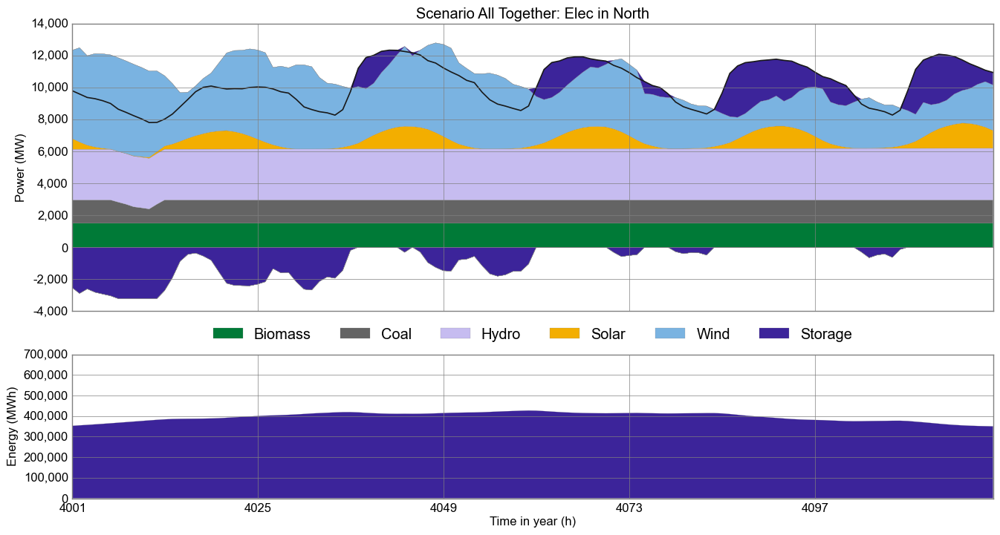
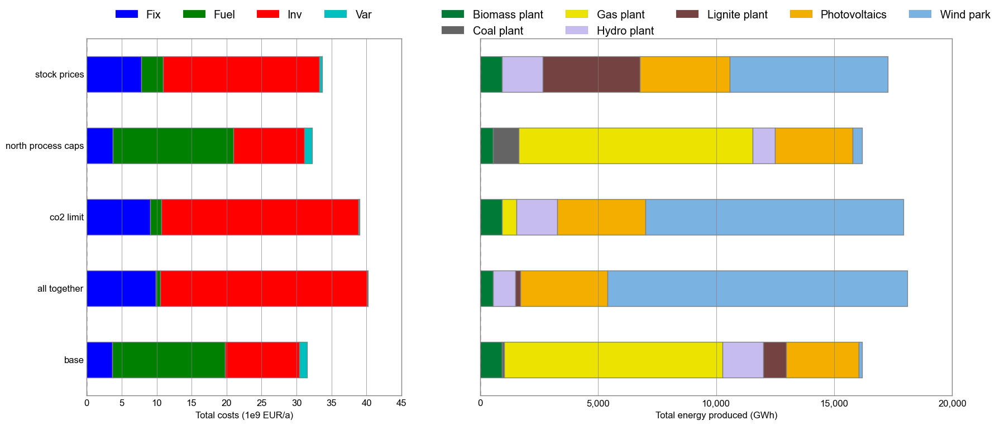

# urbs

urbs is a [linear programming](https://en.wikipedia.org/wiki/Linear_programming) optimisation model for capacity expansion planning and unit commitment for distributed energy systems. Its name, latin for city, stems from its origin as a model for optimisation for urban energy systems. Since then, it has been adapted to multiple scales from neighbourhoods to continents.

## Features

  * urbs is a linear programming model for multi-commodity energy systems with a focus on optimal storage sizing and use.
  * It finds the minimum cost energy system to satisfy given demand timeseries for possibly multiple commodities (e.g. electricity).
  * By default, operates on hourly-spaced timesteps (configurable).
  * Thanks to [Pandas](https://pandas.pydata.org), complex data analysis is easy.
  * The model itself is quite small thanks to relying on package [Pyomo](http://www.pyomo.org/).
  * The small codebase includes reporting and plotting functionality.

## Screenshots

## Installation

### Windows

There are 2 ways to get all required packages under Windows. I recommend using the Python distribution Anaconda. If you don't want to use it or already have an existing Python (version 3.5 **recommended**, 2.7 is supported as well) installation, you can also download the required packages by yourself..

#### Anaconda (recommended)

  1. **[Anaconda (Python 3)](http://continuum.io/downloads)**. Choose the 64-bit installer if possible.  
     During the installation procedure, keep both checkboxes "modify PATH" and "register Python" selected! If only higher Python versions are available, you can switch to a specific Python Version by typing `conda install python=<version>`
  2. **Solver**: [GLPK](http://winglpk.sourceforge.net/).
     1. Launch a new command prompt (Win+R, type "cmd", Enter)
     2. Install it via conda by `conda install -c conda-forge glpk`. It will add it to the path variable, too.
  3. **Pyomo**
     1. Launch a new command prompt (Win+R, type "cmd", Enter)
     2. Type `conda install -c conda-forge pyomo`, hit Enter.

Continue at [Get Started](#get-started).

#### Manually (the hard way)

For all packages, best take the latest release or release candidate version. Both 32 bit and 64 bit versions work, though 64 bit is recommended.

  1. **[Python 3](https://python.org/download)**. Python 2.7 is also supported.
  2. **[pip3](https://pip.pypa.io/en/latest/installing.html)**.The Python package manager. It allows to install many Python packages with a simple command. 
      1. After installation, add `C:\Python3x\Scripts` to environment variable "Path" ([how](http://geekswithblogs.net/renso/archive/2009/10/21/how-to-set-the-windows-path-in-windows-7.aspx)), so that the `pip` command becomes available on the command prompt.
  3. **IPython**: execute `pip install ipython3` in a command prompt.
  4. **SciPy stack:** These require binary installers, made available and maintained by [C. Gohlke](http://www.lfd.uci.edu/~gohlke/pythonlibs/). *How to select the correct file:* Download the newest stable version of each package, whose filename suffix matches both "bitness" (32 bit or 64 bit) and Python version (i.e. 3.x).  
      1. [NumPy](http://www.lfd.uci.edu/~gohlke/pythonlibs/#numpy)
      2. [SciPy](http://www.lfd.uci.edu/~gohlke/pythonlibs/#scipy)
      3. [matplotlib](http://www.lfd.uci.edu/~gohlke/pythonlibs/#matplotlib), requires [dateutil](http://www.lfd.uci.edu/~gohlke/pythonlibs/#python-dateutil), [pytz](http://www.lfd.uci.edu/~gohlke/pythonlibs/#pytz), [pyparsing](http://www.lfd.uci.edu/~gohlke/pythonlibs/#pyparsing) and [six](http://www.lfd.uci.edu/~gohlke/pythonlibs/#six). 
      4. As a test, you can try start `ipython` and have a MATLAB-style command line with plotting capabilities. If you receive message about "ipython could not be found", check if the `C:\Python35\Scripts` is added to the "Path" system variable as described in step 2.i. above.
  5. **[pandas](https://pypi.python.org/pypi/pandas#downloads)**: its [Series](http://pandas.pydata.org/pandas-docs/stable/dsintro.html#series) and [DataFrame](http://pandas.pydata.org/pandas-docs/stable/dsintro.html#dataframe) are used for representing all model input and output. Its capabilities are exploited to write short analysis scripts in `runme.py` and `comp.py`, as well as in the functions `urbs.plot` and `urbs.report`.
  6. **Pyomo**: execute `pip install pyomo` in a command prompt.
  7. **Solver**: [GLPK](http://winglpk.sourceforge.net/).
      1. Simply unzip the latest version somewhere, e.g. `C:\GLPK`. 
      2. Then add the subdirectory `w64`, which contains `glpsol.exe`, to the system path (like in step 2.i.), so that the `glpsol` command is available on the command prompt.
  8. **Excel** reading/writing: `pip install xlrd xlwt openpyxl`

Continue at [Get Started](#get-started).
  
### Linux

One way to install it under Linux can be done by simply using Anaconda/Miniconda and install it like on [Windows](#windows).

Use your Linux distribution's package manager to get all the packages listed in the Windows installation section. Below is the installation procedure for Ubuntu & Debian. Other distributions might have slightly different package names or differing procedures to get the individual packages to run:

  1. **Python and base packages**: `sudo apt-get install python3 python3-pip python3-numpy python3-scipy python3-matplotlib python3-ipython python3-notebook python3-sympy glpk-utils`
  2. **Up-to-date Python packages**: `sudo pip3 install pandas pyomo xlwt xlrd openpyxl`

Continue at [Get Started](#get-started).

  
## Get started

Once installation is complete, finally [install git (for version control)](http://git-scm.com/). **Remark:** at step "Adjusting your PATH environment", select "Run Git from the Windows Command Prompt".

Then, in a directory of your choice, clone this repository and execute the runme script by executing the following on the command prompt (Windows) or Terminal (Linux). (Depending on what your standard python version is, you might need to call `python3` instead of `python`.): 

    git clone https://github.com/tum-ens/urbs.git
    cd urbs
    python runme.py

Some minutes later, the subfolder `result` should contain plots and summary spreadsheets for multiple optimised energy supply scenarios, whose definitions are contained in the run script (watch out for `def scenario` lines). To get a graphical and tabular summary over all scenarios, execute

    python comp.py

and look at the new files `result/mimo-example-.../comp.xlsx` and `result/mimo-example-.../comp.png` for a quick comparison. This script parses the summary spreadsheets for all scenarios.

## Next steps and tipps

  1. Head over to the tutorial at http://urbs.readthedocs.io, which goes through runme.py step by step. 
  2. Read the source code of `runme.py` and `comp.py`. 
  3. Try adding/modifying scenarios in `scenarios.py` and see their effect on results.
  4. If you need a nice python editor, think about using [PyCharm](https://www.jetbrains.com/pycharm/download). It has many features including easy Git integration, package management, etc.
  5. Fire up IPython (`ipython3`) and run the scripts from there using the run command: `run runme` and `run comp`. Then use `whos` and inspect the workspace afterwards (`whos`). See what you can do (analyses, plotting) with the DataFrames. Take the `urbs.get_constants`, `urbs.get_timeseries` and `urbs.plot` functions as inspriation and the [Pandas docs](http://pandas.pydata.org/pandas-docs/stable/) as reference.
  
## Further reading

  - If you do not know anything about the command line, read [Command Line Crash Course](https://learnpythonthehardway.org/book/appendixa.html). Python programs are scripts that are executed from the command line, similar to MATLAB scripts that are executed from the MATLAB command prompt.
  - If you do not know Python, try one of the following ressources:
    * The official [Python Tutorial](https://docs.python.org/3/tutorial/index.html) walks you through the language's basic features.
    * [Learn Python the Hard Way](https://learnpythonthehardway.org/book/preface.html). It is meant for programming beginners.
  - The book [Python for Data Analysis](http://shop.oreilly.com/product/0636920023784.do) best summarises the capabilities of the packages installed here. It starts with IPython, then adds NumPy, slowly fades to pandas and then shows first basic, then advanced data conversion and analysis recipes. Visualisation with matplotlib is given its own chapter, both with and without pandas.
  - For a huge buffet of appetizers showing the capabilities of Python for scientific computing, I recommend browsing this [gallery of interesting IPython Notebooks](https://github.com/ipython/ipython/wiki/A-gallery-of-interesting-IPython-Notebooks).
  
## Example uses

  - Branch [1node](https://github.com/ojdo/urbs/tree/1node) in the forked repository [ojdo/urbs](https://github.com/ojdo/urbs) shows a small example of a real-world usage of the model. It includes a [`scenario_generator`](https://github.com/ojdo/urbs/blob/dfa9cf0ad7b03289bf7c64d79ea93c7886a00a96/run1node.py#L10-L37) function in its run script, which is useful for extensive parameter sweeps.
  - Branch [1house](https://github.com/ojdo/urbs/tree/1house) in the forked repository [ojdo/urbs](https://github.com/ojdo/urbs) shows another (newer) example of a small-scale application of the model. It demonstrates the use for two demand commodities (electricity and heat) for a single consumer (a single site named 'house'). It also shows how to create a very customized comparison script:
  

  
  - Branch [haag15](https://github.com/ojdo/urbs/tree/haag15) in the forked repository [ojdo/urbs](https://github.com/ojdo/urbs) shows a larger example of a real-world use. Its input file contains a town divided into 12 regions, 12 process types, and 2 demand commodities (electricity and heat) . Patience and RAM (64 GB or more) is needed to run these scenarios with 8760 timesteps. The branch also contains three IPython notebooks that are used for result analysis and coupling to model [rivus](https://github.com/tum-ens/rivus).

## Copyright

Copyright (C) 2014-2019  TUM ENS

This program is free software: you can redistribute it and/or modify
it under the terms of the GNU General Public License as published by
the Free Software Foundation, either version 3 of the License, or
(at your option) any later version.

This program is distributed in the hope that it will be useful,
but WITHOUT ANY WARRANTY; without even the implied warranty of
MERCHANTABILITY or FITNESS FOR A PARTICULAR PURPOSE.  See the
GNU General Public License for more details.

You should have received a copy of the GNU General Public License
along with this program.  If not, see <http://www.gnu.org/licenses/>
