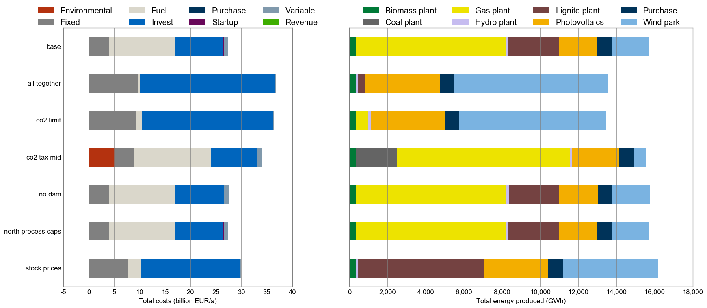

# urbs

urbs is a [linear programming](https://en.wikipedia.org/wiki/Linear_programming) optimisation model for capacity expansion planning and unit commitment for distributed energy systems. Its name, latin for city, stems from its origin as a model for optimisation for urban energy systems. Since then, it has been adapted to multiple scales from neighbourhoods to continents.

## Table of Contents

- [Features](#features)
- [Screenshots](#screenshots)
- [Installation](#installation)
  - [Installing Python](#installing-python)
  - [Installing a Python IDE (optional)](#installing-a-python-ide-optional)
  - [Installing Git](#installing-git)
  - [Cloning the urbs repository](#cloning-the-urbs-repository)
  - [Installing your environment](#installing-your-environment)
  - [Solver](#solver)
- [Get started](#get-started)
- [Next steps and tips](#next-steps-and-tips)
- [Further reading](#further-reading)
- [Example uses](#example-uses)
- [Contributing](#contributing)
- [License](#license)

## Features

  * urbs is a linear programming model for multi-commodity energy systems with a focus on optimal storage sizing and use.
  * It finds the minimum cost energy system to satisfy given demand time  series for possibly multiple commodities (e.g. electricity).
  * By default, operates on hourly-spaced time steps (configurable).
  * Thanks to [Pandas](https://pandas.pydata.org), complex data analysis is easy.
  * The model itself is quite small thanks to relying on package [Pyomo](http://www.pyomo.org/).
  * The small codebase includes reporting and plotting functionality.

## Screenshots

## Installation

### Installing Python

1) Download and install [Python 3.12](https://www.python.org/downloads/). ***Note: Make sure to check the box "Add Python to PATH" during installation.***
2) Using your terminal you can check which Python versions are installed on your system with `py -0` and check your standard version with `python --version`. The output should be `Python 3.12.x` or similar.
     (***Note: If your standard python version is Python 2.X, you might need to call `python3` instead of `python`.***)

### Installing an IDE (optional)

If you want to use an IDE for Python, you can install [PyCharm](https://www.jetbrains.com/pycharm/download/#section=windows) or [Visual Studio Code](https://code.visualstudio.com/). Both are free to use.

### Installing Git

1) Download and install [Git](http://git-scm.com/). Make sure to check the box "Run Git from the Windows Command Prompt" during installation.
You can also use the [GitHub Desktop](https://desktop.github.com/) application if you prefer a graphical user interface.
2) Check that Git is installed by running the command `git --version` in your terminal. 

### Cloning the urbs repository

1) Open your terminal and navigate to your preferred directory.
2) Clone the repository by running the following commands in your terminal.:
   - For GitLab: `git clone git@gitlab.lrz.de:tum-ens/urbs.git`
   - For GitHub: `git clone git@github.com:tum-ens/urbs.git`
3) Navigate to the cloned repository by running `cd urbs` in your terminal.

### Installing your environment

1) In windows you can install the environment by running the batch script `prepare-virtual-environment` in the root directory of the repository.
You can do so from a terminal or by double-clicking the file in the file explorer. This will create a virtual environment and install all necessary packages.
2) If you want to install the environment manually, enter the commands below in your terminal:
- Windows:  
    `py -3.12 -m venv urbs-env`  
    `urbs-env\Scripts\activate`  
    `python -m pip install -r urbs-env.txt`

- Linux/MacOS:  
    `python3.12 -m venv urbs-env`  
    `source urbs-env/bin/activate`  
    `python -m pip install -r urbs-env.txt`

### Solver
There are several solvers that can be used to solve the optimization problems. Our recommendations are the following two python libraries that have been installed in the environment.
- [Highs](https://highs.dev/) (open-source)
- [Gurobi](https://www.gurobi.com/) (commercial): To run this powerful solver you first need to create an account, apply for an academic license in the license center and download it ([descriptions](https://www.gurobi.com/features/academic-named-user-license/)).

However, also other solvers such as [glpk](https://www.gnu.org/software/glpk/) (open-source) or [CPLEX](https://www.ibm.com/analytics/cplex-optimizer) (commercial) are compatible with the Pyomo interface in urbs.

### (optional) Installing Jupyter Notebook
If you want to use the Jupyter Notebook, install it by running `python -m pip install jupyter` in your terminal.

## Get started

Before running a script, ensure your environment is activated:
- Either set up your interpreter in your IDE with your created environment.
- Or, if running from your terminal, use the following command to activate it:
  - Windows: `urbs-env\Scripts\activate`
  - Linux/MacOS: `source urbs-env/bin/activate`

In the downloaded directory, open a execute the runme script by using the following on the command prompt or Terminal. 
  (***Note: Depending on what your standard python version is, you might need to call `python3.12` instead of `python`.***):
 
    python runme.py

Some minutes later, the subfolder `result` should contain plots and summary spreadsheets for multiple optimised energy supply scenarios, whose definitions are contained in the run script (watch out for `def scenario` lines). *Not working at the moment:* To get a graphical and tabular summary over all scenarios, execute

    python comp.py

and look at the new files `result/mimo-example-.../comparison.xlsx` and `result/mimo-example-.../comparison.png` for a quick comparison. This script parses the summary spreadsheets for all scenarios.

## Next steps and tips

  1. Head over to the tutorial at http://urbs.readthedocs.io, which goes through runme.py step by step or try out the Jupyter Notebook tutorial inside the teaching folder. 
  2. Read the source code of `runme.py` and `comp.py`. 
  3. Try adding/modifying scenarios in `scenarios.py` and see their effect on results.
  4. If you need a nice python editor, think about using [PyCharm](https://www.jetbrains.com/pycharm/download). It has many features including easy Git integration, package management, etc.
  5. Fire up IPython (`ipython3`) and run the scripts from there using the run command: `run runme` and `run comp`. Then use `whos` and inspect the workspace afterwards (`whos`). See what you can do (analyses, plotting) with the DataFrames. Take the `urbs.get_constants`, `urbs.get_timeseries` and `urbs.plot` functions as inspriation and the [Pandas docs](http://pandas.pydata.org/pandas-docs/stable/) as reference.
  
## Further reading

  - If you do not know anything about the command line, read [Command Line Crash Course](https://learnpythonthehardway.org/book/appendixa.html). Python programs are scripts that are executed from the command line, similar to MATLAB scripts that are executed from the MATLAB command prompt.
  - If you do not know Python, try one of the following ressources:
    * The official [Python Tutorial](https://docs.python.org/3/tutorial/index.html) walks you through the language's basic features.
    * [Learn Python the Hard Way](https://learnpythonthehardway.org/book/preface.html). It is meant for programming beginners.
  - The book [Python for Data Analysis](http://shop.oreilly.com/product/0636920023784.do) best summarises the capabilities of the packages installed here. It starts with IPython, then adds NumPy, slowly fades to pandas and then shows first basic, then advanced data conversion and analysis recipes. Visualisation with matplotlib is given its own chapter, both with and without pandas.
  - For a huge buffet of appetizers showing the capabilities of Python for scientific computing, I recommend browsing this [gallery of interesting IPython Notebooks](https://github.com/ipython/ipython/wiki/A-gallery-of-interesting-IPython-Notebooks).
  
## Example uses

  - Branch [1node](https://github.com/ojdo/urbs/tree/1node) in the forked repository [ojdo/urbs](https://github.com/ojdo/urbs) shows a small example of a real-world usage of the model. It includes a [`scenario_generator`](https://github.com/ojdo/urbs/blob/dfa9cf0ad7b03289bf7c64d79ea93c7886a00a96/run1node.py#L10-L37) function in its run script, which is useful for extensive parameter sweeps.
  - Branch [1house](https://github.com/ojdo/urbs/tree/1house) in the forked repository [ojdo/urbs](https://github.com/ojdo/urbs) shows another (newer) example of a small-scale application of the model. It demonstrates the use for two demand commodities (electricity and heat) for a single consumer (a single site named 'house'). It also shows how to create a very customized comparison script:
  

  
  - Branch [haag15](https://github.com/ojdo/urbs/tree/haag15) in the forked repository [ojdo/urbs](https://github.com/ojdo/urbs) shows a larger example of a real-world use. Its input file contains a town divided into 12 regions, 12 process types, and 2 demand commodities (electricity and heat) . Patience and RAM (64 GB or more) is needed to run these scenarios with 8760 timesteps. The branch also contains three IPython notebooks that are used for result analysis and coupling to model [rivus](https://github.com/tum-ens/rivus).

## Copyright

Copyright (C) 2014-2019  TUM ENS

This program is free software: you can redistribute it and/or modify
it under the terms of the GNU General Public License as published by
the Free Software Foundation, either version 3 of the License, or
(at your option) any later version.

This program is distributed in the hope that it will be useful,
but WITHOUT ANY WARRANTY; without even the implied warranty of
MERCHANTABILITY or FITNESS FOR A PARTICULAR PURPOSE.  See the
GNU General Public License for more details.

You should have received a copy of the GNU General Public License
along with this program.  If not, see <http://www.gnu.org/licenses/>
