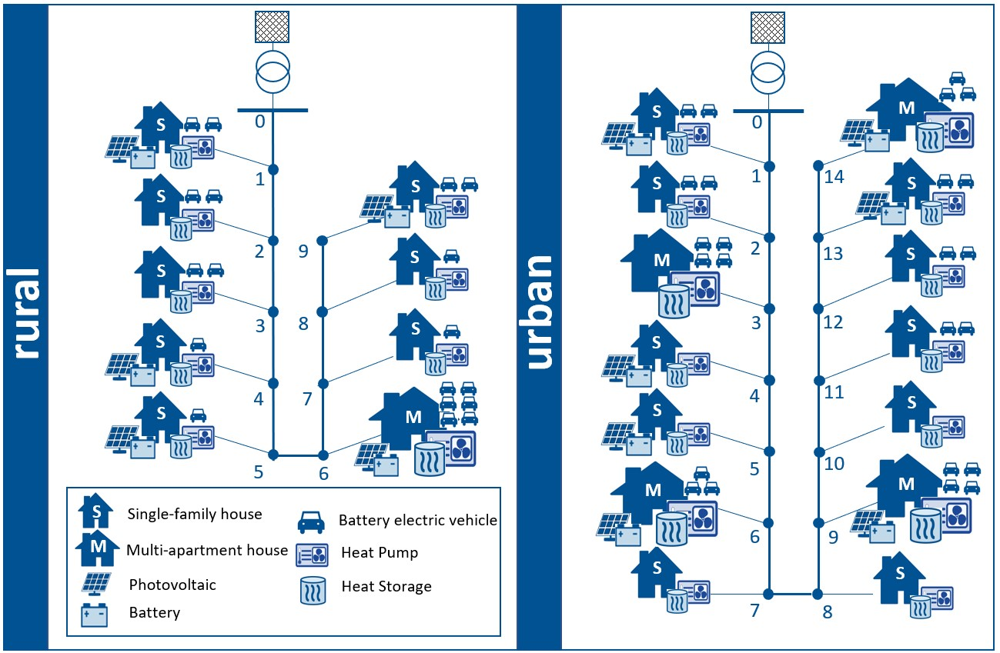

.. _distribution_system_implementation:

Distribution System Framework
===================================

This section explains the implementations to consider specific distribution system characteristics.
Major additions & modifications were applied to the the following scripts:

- `model.py: <distribution_system_implementation.html#model-section>`_

- `transmission.py: <distribution_system_implementation.html#transmission-section>`_

which will be described below.
| Before dealing with the code, a short summary of required aspects to consider will be given.
    Distribution systems are different from transmission systems in a number of facets. Differences to highlight are the
    reactance-to-resistance ratio (X/R) and their common radial composition. Depending on these attributes an AC
    optimal-power-flow model may be helpful to deal with distribution system reactive power and voltage constraints.
    Hence, the "LinDistFlow" model linearization has been introduced into the given framework as shown in `transmission.py <distribution_system_implementation.html#transmission-section>`_.
    Besides, we enhanced the `urbs` framework by integrating several aspects that characterize classic distribution systems:

- radially-operated open ring grid segments

- a transformer between both system levels modelled with a boundary bus

- reactive power demand for households

- reactive power line flows and an apparent power line flow constraint

- a central reactive power compensation system

- inverters with a predefined permittible ratio of reactive to active power generation.

The microgrids to describe the distribution system can be freely defined with the microgrid input sheets.
The predefined microgrid structure with their assigned technologies as provided in the input data are illustrated below:

	
.. _model-section:

Implementations: ``model.py``
----------------------------------

The extensions within this module mainly include reactive power consideration for processes. In order to do so, all components located at distribution system nodes are identified with the 'min-voltage' parameter' which is determined in the "sites" sheet of the microgrid input data. This set is used in this module and in the ``urbs/transmission.py`` module as explained later.

::

    m.sit_tuples_ac = pyomo.Set(
        within=m.stf * m.sit,
        initialize=[(stf, site) for (stf, site) in m.sit_tuples
                    if m.site_dict['min-voltage'][(stf, site)] > 0],
        doc='Combinations of support timeframes and sites with ac characteristics')		

In this module the reactive power output share is typically indicated with the power factor :math:`\phi` that can be
defined for each process in the input sheet.It describes the ratio of real power over apparent power. With this for
instance PV-inverters can be enabled to provide inductive and capacitive reactive power.
The permissible ratio of active and reactive power output for generators is implemented into the model with the
following rules that connect the reactive with the active power output by defining upper and lower generation limits for
the previously defined set:

::
	
	def def_process_output_reactive_rule1(m, tm, stf, sit, pro):
		return (m.e_pro_out[tm, stf, sit, pro, 'electricity-reactive'] <=
                m.e_pro_out[tm, stf, sit, pro, 'electricity']
                * math.tan(math.acos(m.process_dict['pf-min'][(stf, sit, pro)])))
	def def_process_output_reactive_rule2(m, tm, stf, sit, pro):
		return (m.e_pro_out[tm, stf, sit, pro, 'electricity-reactive'] >=
                -m.e_pro_out[tm, stf, sit, pro, 'electricity']
                * math.tan(math.acos(m.process_dict['pf-min'][(stf, sit, pro)])))
				 
Furthermore, a set with all boundary buses denoted as slackbuses representing the transformer on the distribution system site is defined as follows:

::

    m.sit_slackbus = pyomo.Set(
        within=m.stf * m.sit,
        initialize=[(stf, site)for (stf, site) in m.sit_tuples
                    if m.site_dict['ref-node'][(stf, site)] == 1],
        doc='Set of all reference nodes in defined microgrids')

In the ``transmission.py`` module this set is applied to define the voltage level of each microgrid as defined with the base-voltage parameters.
		

.. _transmission-section:

Implementations: ``transmission.py``
-----------------------------------------

Transmission lines can only transport one single commodity in the given model framework. Therefore, imaginary extra lines are created in the ``transdisthelper.py`` module. Active and reactive power flows are coupled with a redefined transmission line capacity constraint using a new rule that considers the apparent power:

::

	def def_transmission_input_by_apparent_power_rule(m, tm, stf, sin, sout, tra, com):
		return (m.e_tra_in[tm, stf, sin, sout, tra, 'electricity']**2 
		+ m.e_tra_in[tm, stf, sin, sout, tra, 'electricity-reactive']**2
		<= (m.dt * m.cap_tra[stf, sin, sout, tra, com])**2)

To consider the correct lines in a coupled model the distribution system transmission tuple set is created for all predefined lines.
The resistance is required in the input sheet to activate the distribution system linearization method. The resistance parameter should be greater than 0 and given in per-unit system. The new ``m.def_ac_power_flow`` constraint applies the following rule to the resulting tupel set of lines:

::		

	def def_ac_power_flow_rule(m, tm, stf, sin, sout, tra, com):
    return (m.voltage_squared[tm, stf, sin] == m.voltage_squared[tm, stf, sout] +
		2* (m.transmission_dict['resistance'][(stf, sin, sout, tra, 'electricity')]
		* m.e_tra_in[tm, stf, sin, sout, tra, 'electricity']
		+ m.transmission_dict['reactance'][(stf, sin, sout, tra, 'electricity-reactive')]
		* m.e_tra_in[tm, stf, sin, sout, tra, 'electricity-reactive']))
				 
In comparison to the DC-OPF :ref:`theory-multinode` model, the key difference is that the nodal voltage magnitudes :math:`V^2` are related to the active and reactive power branch flows with the respective line impedance.
After creating the new variable `voltage_squared` for this quantity

::

    m.voltage_squared = pyomo.Var(
        m.tm, m.sit_tuples_ac,
        within=pyomo.Reals,
        doc='Voltage^2 of a site')

another constraint is introduced in order to monitor the permissible voltage range for all distribution system sites included in a new set that has been defined in ``urbs/model.py``.
This is achieved with the new `def_voltage_limit` constraint applying the following rule:

::

	def def_voltage_limit_rule(m, tm, stf, sin):
		return ((m.site_dict['base-voltage'][(stf, sin)] * m.site_dict['min-voltage'][(stf, sin)])**2,
		m.voltage_squared[tm, stf, sin],
		(m.site_dict['base-voltage'][(stf, sin)] * m.site_dict['max-voltage'][(stf, sin)])**2)

Moreover, the voltage of all nodes within the introduced slackbus set is scaled to the base voltage of the respective grid, that is defined within the input sheet:

::
	
	def def_slackbus_voltage_rule(m, tm, stf, sin):
		return (m.voltage_squared[tm, stf, sin] == m.site_dict['base-voltage'][(stf, sin)]**2)
