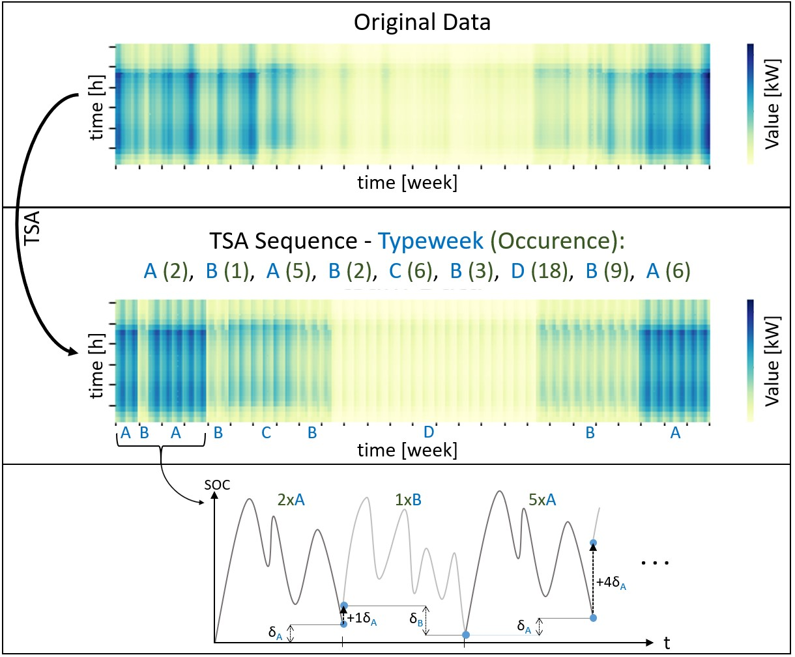

.. _typeperiod_tsam_implementation:

Time Series Aggregation with Typeperiods
==========================================

Typeperiod Motivation
--------------------------

The type period module has been adapted into the urbs framework by Daniel Zinsmeister and modified to fit into our
approach as described below. It allows to scale selected periods to represent the entire year. In energy system models
it is popular to do so as there are recurring patterns in relevant timeseries such as demand or solar irradiation
profiles. For instance, typical periods for summer and winter time can be chosen and scaled with the corresponding
incidence of expected summer/winter periods. Thereby, economic (costs) and environmental (emissions) effects can be scaled adequately.

Approach with the 'tsam' Method
----------------------------------
Hereby, the challenge is to
choose the most representative period of a season. The timestep selection must hold for all input timeseries.
Considering only one solar irradiation curve when defining two typical periods for summer and winter, it is
possible to manually choose the best fitting weeks within the year. However, even a simplified model of a country
considers approximately 100 distinct profiles. Hence, it is not possible to manually choose the most suitable
representative periods and a mathematical and automated method is necessary instead. Therefore, to choose the best
fitting typeperiods an open source python package called tsam is used, that applies machine learning methods and has
been developed by Leander Kotzur, Maximilian Hoffmann, Peter Markewitz, Martin Robinius and Detlef Stolten.To understand
the tsam procedure in detail see their provided `tsam documentation <https://tsam.readthedocs.io/en/latest/index.html>`__.
Summarized, a predefined number of type periods with a selected number of hours per period is calculated to optimally represent
the original data for all timeseries simultaneously. This is realized by optimizing cluster groups with the Root-Mean-Squared-Error
(RMSE) as objective functional value. Thereby, redundant data are minimized and thereby computational complexity can be substantially decreased.

In our approach before giving the timeseries data to the tsam algorithm, for all redundant profiles, a 'Python' dictionary is created to
remember the equal profiles which have been handed over. Next all duplicates are deleted.
By doing so the number of input timeseries in our approach could be reduced from 1638 to 95.

::

    def run_tsam(data, noTypicalPeriods, hoursPerPeriod, cross_scenario_data):
        ### bring together all time series data
        time_series_data = pd.concat([data['demand'], data['supim'], data['buy_sell_price'],
                                      data['eff_factor']], axis=1, sort=True)
        ### create dict
        equal_col_dict = dict()
        for col1 in time_series_data.columns:
            time_series_data2 = time_series_data.drop(columns = col1)
            for col2 in time_series_data2.columns:
                if time_series_data[col1].equals(time_series_data2[col2]):
                    equal_col_dict[col1] = col2
                    break
        ### drop duplicate timeseries
        time_series_data = time_series_data.T.drop_duplicates().T

This dictionary is used after the application of the timeseries aggregation to allocate the results to all original profiles.

Enabling Seasonal Storage Solutions
-----------------------------------------

The motivation to apply typical periods is to weight cluster periods based on their total incidence number.
The explicit chain of periods and thus the transition between distinct periods is not considered. Thereby, the overall
number of periods to model keeps low and thus the computational complexity is reduced. Despite, the disadvantage is that
the possibility of energy exchange between periods is disregarded. As a consequence, storage components must be
modelled with an additional constraint denoted as cyclicity condition setting all period's final storage SOCs equal to
the initial values.

::

    ### original timeset for cyclicity rule
    m.t_endofperiod = pyomo.Set(
        within=m.t,
        initialize=t_endofperiod_list,
        ordered=True,
        doc='timestep at the end of each timeperiod')

    ### cyclicity contraint
    m.res_storage_state_cyclicity_typeperiod = pyomo.Constraint(
        m.t_endofperiod, m.sto_tuples,
        rule=res_storage_state_cyclicity_typeperiod_rule,
        doc='storage content initial == storage content at the end of each timeperiod')

    ### cyclicity rule without tsam
    def res_storage_state_cyclicity_typeperiod_rule(m, t, stf, sit, sto, com):
        return (m.e_sto_con[m.t[1], stf, sit, sto, com] == m.e_sto_con[t, stf, sit, sto, com])

The resulting main disadvantage is that long-term storage solutions that are essential for RE-dominant energy systems
cannot be considered appropriately.
Therefore, we apply a time series aggregation method with typical weeks combined with an additional storage constraint
that enables the exchange of energy between consecutive, alternating periods (for instance the type periods A and B).
This relaxes the cyclicity condition within a given type period, i.e. a total SOC change within a given type period A is allowed.
The basic idea is illustrated below for four typical weeks:

The definition of required sets, variables, constraints and rules to implement this idea are presented below:

::

    ### sets
    m.t_endofperiod = pyomo.Set(
        within=m.t,
        initialize=t_endofperiod_list,
        ordered=True,
        doc='timestep at the end of each timeperiod')
    m.subsequent_typeperiods = pyomo.Set(
        within=m.t * m.t,
        initialize=subsequent_typeperiods_list,
        ordered=True,
        doc='subsequent timesteps between two typeperiods')
    m.start_end_typeperiods = pyomo.Set(
        within=m.t * m.t,
        initialize=start_end_typeperiods_list,
        ordered=True,
        doc='start and end of each modeled typeperiod as tuple')

    ### SOC variable
    m.deltaSOC = pyomo.Var(
        m.t_endofperiod, m.sto_tuples,
        within=pyomo.Reals,
        doc='Variable to describe the delta of a storage within each period')

    ### constraints
    ### constraint to describe the SOC difference of a storage within a repeating period A
    m.res_delta_SOC = pyomo.Constraint(
        m.start_end_typeperiods, m.sto_tuples,
        rule=res_delta_SOC,
        doc='delta_SOC_A = weight * (SOC_A_tN - SOC_A_t0)')

    ### SOC constraint for two consecutive typeperiods A and B
    m.res_typeperiod_delta_SOC = pyomo.Constraint(
        m.subsequent_typeperiods, m.sto_tuples,
        rule=res_typeperiod_deltaSOC_rule,
        doc='SOC_B_t0 = SOC_A_t0 + delta_SOC_A')

    ### new ciclycity constraint for typeperiods
    m.res_storage_state_cyclicity_typeperiod = pyomo.Constraint(
        m.sto_tuples,
        rule=res_storage_state_cyclicity_rule_typeperiod,
        doc='storage content end >= storage content start - deltaSOC[last_typeperiod]')

    ### rules
    ### SOC rule for each repeating typeperiod
    def res_delta_SOC(m, t_0, t_end, stf, sit, sto, com):
        return ( m.deltaSOC[t_end, stf, sit, sto, com] ==
                (m.typeperiod_weights[t_end] - 1) * (m.e_sto_con[t_end, stf, sit, sto, com]
                - m.e_sto_con[t_0, stf, sit, sto, com]))

    ### new storage rule using tsam considering the delta SOC per repeating typeperiod
    def res_typeperiod_deltaSOC_rule(m, t_A, t_B, stf, sit, sto, com):
        return (m.e_sto_con[t_B, stf, sit, sto, com] ==
                m.e_sto_con[t_A, stf, sit, sto, com] + m.deltaSOC[t_A, stf, sit, sto, com])

    ### new ciclycity rule for typeperiods
    def res_storage_state_cyclicity_rule_typeperiod(m, stf, sit, sto, com):
        return (m.e_sto_con[m.t[len(m.t)], stf, sit, sto, com] >=
                m.e_sto_con[m.t[1], stf, sit, sto, com] - m.deltaSOC[m.t[len(m.t)], stf, sit, sto, com])

