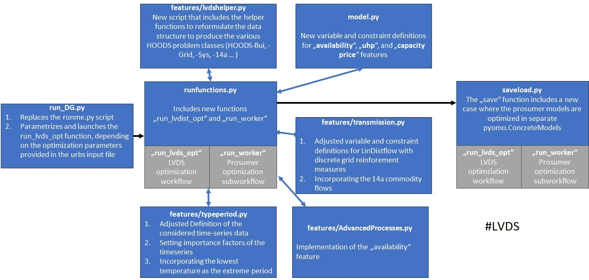

Overview
--------

The implementation of low-voltage distribution system (LVDS) optimization is based on the
disseration of Soner Candas "Optimization and data acquisition suite for low-voltage
distribution grids in transformation".

This documentation deals with the changes introduced to the urbs "CoTraDis" branch.
For summary, the following figure describes these changes in few bulletpoints.

Additional to the code, the changes made to the urbs input file are described in :ref:`LVDS-input-data`.