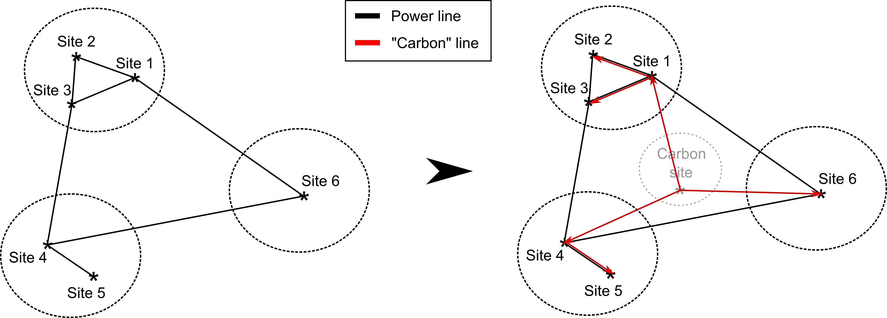

.. _admm_theory:

Alternating direction method of multipliers (ADMM)
--------------------------------------------------
The decomposition methods implemented in this branch are based on the consensus variant of the alternating direction method of multipliers (ADMM).

Theoretical background of consensus ADMM
^^^^^^^^^^^^^^^^^^^^^^^^^^^^^^^^^^^^^^^^
ADMM belongs to a family of decomposition methods based on dual decomposition. To understand its working principle, let's have a look at the following problem:

.. math::

 \min_{\boldsymbol x_1,\boldsymbol x_2,\boldsymbol y_1,\boldsymbol y_2}\; &f_1(\boldsymbol x_1,\boldsymbol y_1) + f_2(\boldsymbol x_2,\boldsymbol y_2)  \\
 \text{s.t.} &\ \  \boldsymbol x_1 \in \chi_1, \ \  \boldsymbol x_2 \in \chi_2 \\

where indices :math:`1, 2` denote the first and second subsystems (e.g. two regions in an energy system model), with :math:`\boldsymbol x_1, x_2` as the sets of variables which are internal to the subsystems 1 and 2 respectively (e.g. set of generated power by processes in these subregions), :math:`\boldsymbol y` as the coupling variables between the subsystems 1 and 2 (e.g. the power flow between these subregions).

By creating two local copies of the complicating variable (:math:`\boldsymbol y_1, \boldsymbol y_2`) and introducing a "consensus" constraint which equates these to a global :math:`\boldsymbol y_g`, this problem can be reformulated as follows:

.. math::

 \min_{\boldsymbol x_1,\boldsymbol x_2,\boldsymbol y_1,\boldsymbol y_2} &\ \  f_1(\boldsymbol x_1,\boldsymbol y_1) + f_2(\boldsymbol x_2,\boldsymbol y_2) \\
 \text{s.t.} &\ \  \boldsymbol x_1 \in \chi_1, \ \  \boldsymbol x_2 \in \chi_2 \\
 &\ \ \boldsymbol y_1 = \boldsymbol y_{g} \ \ \ : \boldsymbol \lambda_1 \\
 &\ \ \boldsymbol y_2 = \boldsymbol y_{g} \ \ \ : \boldsymbol \lambda_2,

where :math:`\boldsymbol \lambda_1, \boldsymbol \lambda_2,` are the dual variables (Lagrange multipliers) of the two consensus constraints respectively. The augmented Lagrangian of such a problem looks as follows (with a set penalty parameter :math:`\rho`):

.. math::

 &L(\boldsymbol x_1,\boldsymbol x_2,\boldsymbol y_1,\boldsymbol y_2,\boldsymbol \lambda_1,\boldsymbol \lambda_2)_{\boldsymbol x_1 \in \chi_1, \boldsymbol x_2 \in \chi_2} \\
  &= f_1(\boldsymbol x_1,\boldsymbol y_1) + f_2(\boldsymbol x_2,\boldsymbol y_2) + \boldsymbol \lambda_1^T(\boldsymbol y_1-\boldsymbol y_g) +\boldsymbol \lambda_2^T(\boldsymbol y_2-\boldsymbol y_g)+\dfrac{\rho}{2}\left\lVert \boldsymbol y_1 - \boldsymbol y_{g}\right\rVert_2^2 + \dfrac{\rho}{2}\left\lVert \boldsymbol y_2 - \boldsymbol y_{g}\right\rVert_2^2

From here, the essence of the consensus ADMM lies on decoupling this Lagrangian by fixing the global value and the Lagrangian multipliers which correspond to the consensus variables. For this, an arbitrary initialization can be made (:math:`\boldsymbol y_g^0:=\boldsymbol y^0`, :math:`\boldsymbol \lambda_{1,2}^0:=\boldsymbol \lambda^0`).

Then the following steps are applied for each iteration :math:`\nu=\{1,\dots, \nu_\text{max}\}`:

1) Through the fixing (or initialization, in case of the first step) of the global value and the Lagrangian multipliers, the decoupled models can be solved independently from each other:

.. math::

 (\boldsymbol x^{\nu+1}_1,\boldsymbol y^{\nu+1}_1)=\text{arg}\min_{\boldsymbol x_1,\boldsymbol y_1}  & f_1(\boldsymbol x_1,\boldsymbol y_1)+(\boldsymbol \lambda^\nu_1)^T(\boldsymbol y_1-{\boldsymbol y^\nu_g})+\dfrac{\rho}{2}\left\lVert \boldsymbol y_1 - \boldsymbol y_{g}\right\rVert_2^2 \text{s.t.} \ \  \boldsymbol x_1 \in \chi_1 \\
 (\boldsymbol x^{\nu+1}_2,\boldsymbol y^{\nu+1}_2)=\text{arg}\min_{\boldsymbol x_2,\boldsymbol y_2}  & f_1(\boldsymbol x_2,\boldsymbol y_2)+(\boldsymbol \lambda_2^\nu)^T(\boldsymbol y_2-\boldsymbol y_g^\nu)+\dfrac{\rho}{2}\left\lVert \boldsymbol y_2 - \boldsymbol y_g^\nu\right\rVert_2^2 \text{s.t.} \ \  \boldsymbol x_2 \in \chi_2

2) Using these solutions, an averaging step is made to calculate the global value of the coupling variable to be used in the next iteration:

.. math::

 {\boldsymbol y_g}^{\nu+1}:=(\boldsymbol y_1^{\nu+1}+\boldsymbol y_2^{\nu+1})/2

3) Then, the consensus Lagrangian multipliers need to be updated for each subproblem:

.. math::

 \boldsymbol \lambda_{1,2}^{\nu+1}:=\boldsymbol \lambda_{1,2}^\nu+\rho \left(\boldsymbol y_{1,2}^{\nu+1}-{\boldsymbol y_g}^{\nu+1}\right)

4) Using the values obtained from 2) and 3), the primal and dual residuals are calculated for each subproblem:

.. math::

 r_{1,2}^{\nu+1} = \left\lVert \boldsymbol y^\nu_{1,2} - {\boldsymbol y_g}^\nu \right\rVert_2^2 \\
 d_{1,2}^{\nu+1} = \rho \dot \left\lVert {\boldsymbol y_g}^{\nu+1} - {\boldsymbol y_g}^\nu \right\rVert_2^2

The steps 1, 2, and 3 and 4 are followed until convergence, which corresponds to the condition of primal and dual residuals being smaller than a user-set tolerance. For a more detailed description of consensus ADMM, please refer to the following material: https://stanford.edu/class/ee367/reading/admm_distr_stats.pdf.

Theoretical background of the asynchronous consensus ADMM
^^^^^^^^^^^^^^^^^^^^^^^^^^^^^^^^^^^^^^^^^^^^^^^^^^^^^^^^^
The consensus ADMM, whose steps were described above, is a synchronous algorithm. This means, each subproblem needs to be solved (step 1), in order for the updates (steps 2, 3) to take place before moving onto the next iteration. When the subproblems are solved in parallel for runtime benefits, this may lead to a so-called "straggler effect", where the performance of the algorithm is constrained by its slowest subproblem. This is often the case when the subproblems differ in sizes considerables (leading the small subproblems to have to wait for a larger problem to be solved).

In order to tackle this issue, an asynchronous variant of ADMM is formulated, where:

i) partial information from neighbours (a certain percentage :math:`\eta` of the neighbors) is sufficient for each subproblem to move onto the next iteration, and
ii) the updating steps (2, 3) and the convergence checks take place locally rather than globally.

The specific algorithm is partially based on https://arxiv.org/abs/1710.08938. Here, a brief explanation of the algorithm will be made. For a more detailed description, please refer to this material.

Let us assume that our problem consists of the subsystems :math:`k\in \{1,\dots,\mathcal N\}`, with each subsystem :math:`k` sharing some variable(s) with its neighbors :math:`\mathcal N_k`. Asynchronicity takes places by each subproblem receiving the solutions from only up to :math:`\left \lceil{\eta \lVert \mathcal N_k \rVert}\right \rceil` neighbors before moving on to the next iteration. Since it takes different time for each of these subproblems to receive these information, each subproblem has their own iteration counters :math:`\nu_k`. A generalized notation of the problem variables are as follows:

+------------------------------------+-----------------------------------------------------------------------------------------------------------------------------------------+
| Variable                           | Description                                                                                                                             |
+====================================+=========================================================================================================================================+
| ..math..`\boldsymbol x_k`          | Internal variables of subsystem ..math..`k`                                                                                             |
+------------------------------------+-----------------------------------------------------------------------------------------------------------------------------------------+
| ..math..`\boldsymbol y_{kl}`       | Set of the coupling variables between subsystems ..math..`k` and ..math..`l` in subproblem ..math..`k`                                  |
+------------------------------------+-----------------------------------------------------------------------------------------------------------------------------------------+
| ..math..`\boldsymbol y_{k}`        | Set of the coupling variables between subsystems ..math..`k` and all its neighbors ..math..`\mathcal N_k` in subproblem ..math..`k`     |
+------------------------------------+-----------------------------------------------------------------------------------------------------------------------------------------+
| ..math..`\boldsymbol y_{g,kl}`     | Set of the (now locally defined) global value of `\boldsymbol y_{kl}` in subproblem ..math..`k`                                         |
+------------------------------------+-----------------------------------------------------------------------------------------------------------------------------------------+
| ..math..`\boldsymbol y_{g,k}`      | Set of the (now locally defined) global value of all coupling variables ..math..`\boldsymbol y_{k}` in subproblem ..math..`k`           |
+------------------------------------+-----------------------------------------------------------------------------------------------------------------------------------------+
| ..math..`\boldsymbol \lambda_{kl}` | Set of the Lagrange multipliers for the consensus constraint `\boldsymbol y_{kl} =\boldsymbol y_{g,kl}` in the subproblem ..math..`k`   |
+------------------------------------+-----------------------------------------------------------------------------------------------------------------------------------------+
| ..math..`\boldsymbol \lambda_{k}`  | Set of the Lagrange multipliers for all consensus constraints `\boldsymbol y_{k} =\boldsymbol y_{g,k}` in the subproblem ..math..`k`    |
+------------------------------------+-----------------------------------------------------------------------------------------------------------------------------------------+
| ..math..`\rho_{k}`                 | Quadratic penalty parameter of the subproblem ..math..`k`                                                                               |
+------------------------------------+-----------------------------------------------------------------------------------------------------------------------------------------+

The asynchronous ADMM algorithm for each subsystem ..math..`k` operates as follows:

1) Through the fixing (or initialization, in case of the first step) of the global values and the Lagrangian multipliers, the decoupled model can be solved independently in parallel to the others:

.. math::

 (\boldsymbol x^{\nu_k+1}_k, \boldsymbol y^{\nu_k+1}_{k})=\text{arg}\min_{\boldsymbol x_k,\boldsymbol y_k}   f_k(\boldsymbol x_k,\boldsymbol y_k)+(\boldsymbol \lambda^{\nu_k}_k)^T(\boldsymbol y_k-{\boldsymbol y^{\nu_k}_{g,k}})+\dfrac{\rho_k}{2}\left\lVert \boldsymbol y_k - \boldsymbol y_{g,k}^{\nu_k}\right\rVert_2^2 \text{s.t.} \ \  \boldsymbol x_k \in \chi_k

2) Check if at least :math:`\left \lceil{\eta \lVert \mathcal N_k \rVert}\right \rceil` neighbors have new information to provide. If not, wait for it. If a problem :math:`l` had already been solved multiple times since the last time information was received from it, pick the most recent information (corresponding to its current local iteration :math:`\nu_l`). (:func:`recv` is where this step is implemented):

3) For each neighbor :math:`l` that provided new information, apply a modified averaging step (:func:`update_z` is where this step is implemented).

.. math::

 \forall l \in \mathcal N_k \text{ with new information: } \ {\boldsymbol y^{\nu+1}_{g,kl}}:=\dfrac{\boldsymbol \lambda_{kl} + \boldsymbol \lambda_{lk} + \rho_k\ \boldsymbol y_{kl}^{\nu_k+1}+\rho_l\ \boldsymbol y^{\nu_l}_{lk}}{\rho_k + \rho_l}

This update step looks differently than that of synchronous ADMM, as it factors for the inaccuricies which arise from asynchronicity.

3) Update (all) consensus Lagrangian multipliers of subproblem ::math::`k` as usual:

.. math::

 \boldsymbol \lambda_{k}^{\nu_k+1}:=\boldsymbol \lambda_{k}^{\nu_k}+\rho \left(\boldsymbol y_{k}^{\nu_k+1}-{\boldsymbol y_{g,k}^{\nu_k+1}}\right)

4) Update (all) consensus Lagrangian multipliers of subproblem ::math::`k` as usual:

.. math::

 \boldsymbol \lambda_{k}^{\nu_k+1}:=\boldsymbol \lambda_{k}^{\nu_k}+\rho \left(\boldsymbol y_{k}^{\nu_k+1}-{\boldsymbol y_{g,k}^{\nu_k+1}}\right)

5) To check the convergence of a subproblem, collect all primal and dual residuals from the neighbors. If the maximum of these residuals is smaller than the convergence tolerance set for this subproblem, the subproblem converges:

.. math::

 r_{k,l}^{\nu+1} = \left\lVert \boldsymbol y^\nu_{kl} - {\boldsymbol y_{g,kl}}^\nu \right\rVert_2^2 \\
 d_{k,l}^{\nu+1} = \rho \dot \left\lVert {\boldsymbol y_g}^{\nu+1} - {\boldsymbol y_g}^\nu \right\rVert_2^2

Interpretation of regional decomposition in urbs
^^^^^^^^^^^^^^^^^^^^^^^^^^^^^^^^^^^^^^^^^^^^^^^^
In this implementation, the urbs model is regionally decomposed into "region clusters", where each model site can be clustered flexibly in separate subproblems. Drawing on the generic problem definition mentioned above, a specification of this notation can be made for urbs in the following way:

.. table::

    ===================================== ==========================================================================================================================================
      Variable                             Description
    ===================================== ==========================================================================================================================================
      ..math..`\boldsymbol x_k`            Process/storage capacities, throughputs, commodity flows... within the region cluster ..math..`k`
      ..math..`\boldsymbol y_{kl}`         Power flows/capacities of transmissions between the region clusters ..math..`k` and ..math..`l` (``e_tra_in(k,l)``, ``cap_tra(k,l)``)
    ===================================== ==========================================================================================================================================
Formulation the global CO2 limit in the consensus form
The intuition is that, when two region clusters are optimized separately, the coupling between them manifests itself in the transmission power flows and capacities between these clusters. Thereby, they constitute the complicating variables of the problem and hence the linear and quadratic consensus terms will have to be added to the respective cost functions. However, a simplification is made here, by ignoring the transmission capacities in the consensus variables. This simplifies the algorithm without having an influence on the feasibility of the solution, since when the consensus for the power flows for a transmission line is achieved, the capacity of this transmission line will be set for each subproblem as the largest flow passing through this line to minimize the costs. In other words, the consensus of the power flows ensures the consensus of the line capacities.

.. _global-CO2-limit-modifications:

Formulation the global CO2 limit in the consensus form
^^^^^^^^^^^^^^^^^^^^^^^^^^^^^^^^^^^^^^^^^^^^^^^^^^^^^^
However, the line flows are not the sole coupling aspect in the urbs model. The global CO2 constraint, which restricts the total CO2 emissions produced by all of the regions, also couple the operation of the subproblem with each other. While this is a coupling constraint (and not a coupling variable), a reformulation into a similar consensus form can be made in the following way:

    - A "dummy" region cluster (consisting of a single region) called ``Carbon site`` is created,
    - A new stock commodity ``Carbon`` is created, which can be created in ``Carbon site`` for free, with a ``max`` amount equal to the global CO2 limit,
    - The ``Carbon`` commodity act as "carbon certificates", such that to each process that emit ``CO2``, it is added as an additional input commodity with an input ratio same as the output ratio of ``CO2``,
    -  The ``Carbon`` commodity created in the ``Carbon site`` can be transported to each other sites for free. Therefore, new transmission "lines" are defined for this commodity, with unlimited capacity and no costs.

Now, the commodity flows of ``Carbon`` can be treated as an intercluster coupling variable (just like the power flows) and, as long as the consensus is achieved, the global CO2 limit will be respected.

