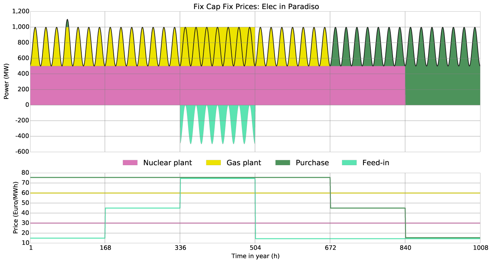
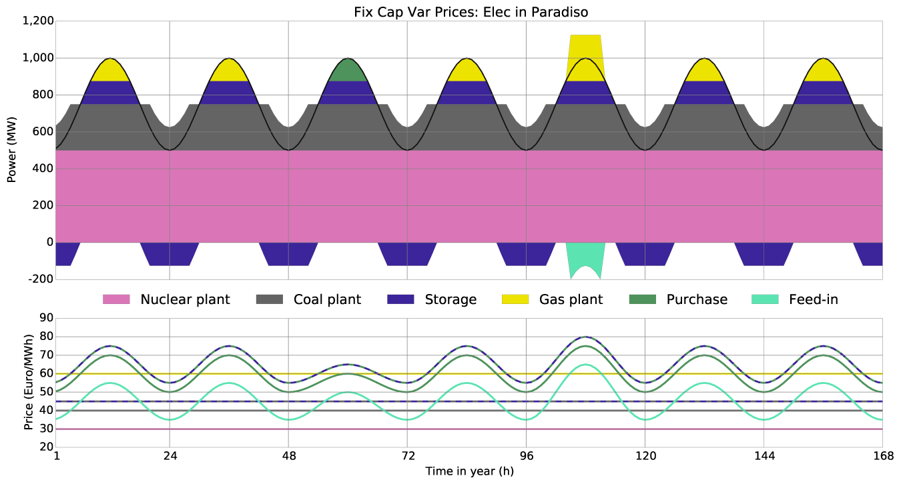
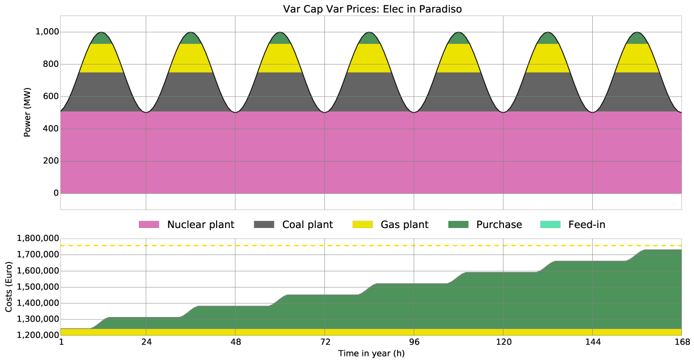
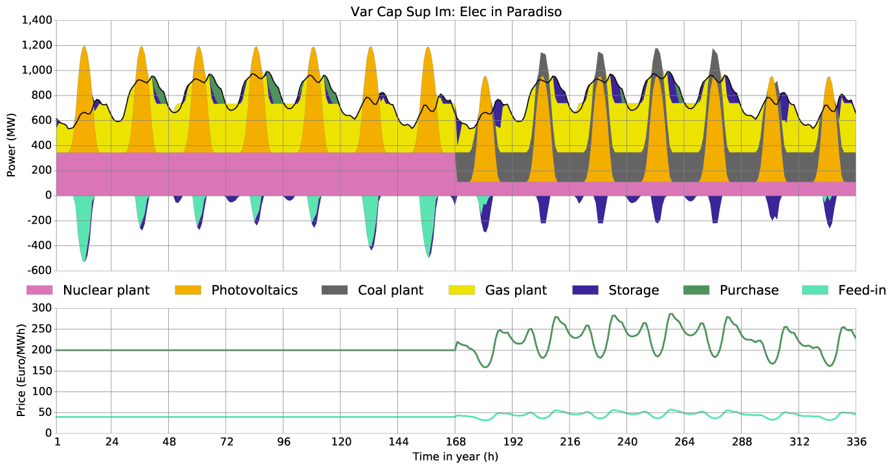

.. module:: urbs

Buy-Sell Documentation
**********************

This documentation explains the buy-sell-price feature of urbs. With it one can
model time variant electricity prices from energy exchanges.

Introduction
============

The prices are independent of the amount of electricity purchased and fed in as
there is no feedback. The size of the modelled market has to be considered
small relative to the surrounding market.
To use this feature your excel input file needs an additional
**Buy-Sell-Price** sheet with the columns ``t`` containing the timesteps and
columns specifying your buy- and sellable commodities, e.g.,
``Elec buy`` and ``Elec sell`` in the mimo-example. The entries then set time
resolved buy and sell prices by default in € per MWh. In the **Commodity** sheet
the new tradable commodities have to be set as type ``Buy`` or ``Sell``. The
price column in the **Commodity** sheet is then reinterpreted as a factor
multiplied to the given price timeseries. For an actual use of the tradeable
commodities they have to be converted into demand commodities in a separate
process.
For a more detailed description of the implementation have a look at the
Mathematical Documentation. 

Exemplification
===============

This section contains prototypical scenarios illustrating the system behaviour
with time variant prices.
Electricity can be moved *locally* with transmission losses and *temporally*
with storage losses.

Fix Capacities - Fix Prices
^^^^^^^^^^^^^^^^^^^^^^^^^^^
All process, transmission and storage capacities and prices are predetermined
and constant.

When is electricity purchased?

- if it is *necessary* that is the demand is greater than the total output
  capacity it is bought at every price
- if it is *profitable* that is if the buy price is lesser than the variable
  costs of the most expensive needed process

When is electricity fed-in?

- if it is *possible* **and** *profitable* that is if the demand is lesser than
  the total output capacity **and** the sell price greater than the cheapest
  currently not needed process

The following scenario illustrates the energy balance of the island Paradiso.
It has a demand of 500-1000 MW that is supplied by a 1500 MW nuclear plant, a
1000 MW gas plant and a 1000 MW transmission cable, that connects the island
grid with the continental grid. Both capacities and prices are fix.

.. csv-table:: Scenario Fix Cap Fix Prices
    :header-rows: 1
    :stub-columns: 1

    Process, eff, inst-cap, inst-cap-out, fuel-cost, var-cost, total-var-cost
    Nuclear plant, 0.33, 1500,  500,            5, 5,       10 
    Gas plant,     0.50, 1000,  500,           25, 5,       30
    Purchase,      1.00, 1000, 1000, **15/45/75**, 0, 15/45/75
    Feed-in,       1.00, 1000, 1000, **15/45/75**, 0, 15/45/75

The modelled timespan is 6 weeks with different fix prices each. In week 1
on the fourth day energy is purchased, because it is neccessary to cover
the demand. In week 2 the sell price is higher than the variable costs of the
nuclear plant, but lower than the variable costs of the cheapest not needed
power plant: the gas plant. In week 3 the sell price excels even those costs
making the production and selling of additional energy profitable.
In week 4 buy prices are too high for purchase and sell prices to low for
feed-in. In week 5 buy prices have dropped enough for purchased energy to
replace energy produced by the gas plant. In week 6 they further dropped
enough to even replace energy produced by the nuclear plant.

Fix Capacities - Variable Prices
^^^^^^^^^^^^^^^^^^^^^^^^^^^^^^^^
All process, transmission and storage capacities are predetermined and
constant, prices are varying over the modelled timespan.

When is electricity purchased?

- if it is *necessary* that is the demand is greater than the total output
  capacity it is bought at every price
- if it is *profitable* that is if the buy price is lesser than the current
  variable costs of the most expensive needed process *or* including storage
  costs lesser than future variable costs of the most expensive needed process

When is electricity fed-in?

- if it is *possible* **and** *profitable* that is if the demand is lesser than
  the total output capacity **and** the sell price greater than the cheapest
  currently not needed process

For the second scenario half of the gas plant is replaced by a coal plant.
Additionally there is a new power limited energy storage with variable storage
costs of 5 €/MWh. The load curve stays the same. Capacities are fix and prices
are varying.

.. csv-table:: Scenario Fix Cap Var Prices
    :header-rows: 1
    :stub-columns: 1

    Process, eff, inst-cap, inst-cap-out, fuel-cost, var-cost, total-var-cost
    Nuclear plant,  0.33, 1500,  500,         5,   5,    10
    **Coal Plant**, 0.40,  625,  250,        11,   5,    16
    Gas plant,      0.50,  500,  250,        25,   5,    30
    **Storage**,    1.00,  125,  125,          , 2.5,     5
    Purchase,       1.00, 1000, 1000, **50-75**,   0, 50-75
    Feed-in,        1.00, 1000, 1000, **35-65**,   0, 35-65

The modelled timespan is 7 days. The buy price varies around the variable costs
of the gas plant. But except for day 3 purchase is only a profitable substitute
for energy from the gas plant at timesteps it is not needed. The sell price
varies around the variable costs of the coal plant. But similar to the buy
price except for day 5 it only allows production of energy for selling at
timesteps it required to cover the demand instead. Producing and storing
energy from the coal plant at timesteps with a low demand limited only by the
storage power capacity is profitable, because it has total variable costs of
45 €/MWh and substitutes ebergy from the gas plant costing 60 €/MWh. At day 5
at noon the sell price exceeds the purchase price 12 hours before by 15 €/MWh.
Even discounting storage costs of 5 €/MWh it would allow infinite arbitrage.
But since the storage capacities are limited the opportunity costs of 15 €/MWh
of substituting energy from the gas plant are higher than the 10 €/MWh profit
margin it is not done.

.. note::

    For trial e.g. of the result of greater storage capacities this
    :download:`paradiso_2.xlsx <paradiso/paradiso_2.xlsx>`
    is the input file used for this scenario.

Variable Capacities - Variable Prices
^^^^^^^^^^^^^^^^^^^^^^^^^^^^^^^^^^^^^
All process, transmission and storage capacities are variable and determined at
optimal total cost, prices are varying over the modelled timespan.

When is electricity purchased?

- if it is *necessary* that is the demand is greater than the total output
  capacity it is bought at every price
- if it is *profitable* that is if the buy price is lesser than the current
  variable costs of the most expensive needed process *or* including storage
  costs lesser than future variable costs of the most expensive needed process
  *or* it reduces the peak load allowing the capacity investments to be
  reduced in a way that overcompensates the additional costs in summary

When is electricity fed-in?

- if it is *possible* **and** *profitable* that is if the demand is lesser than
  the total output capacity **and** the sell price greater than the cheapest
  currently not needed process *and* does not prevent a total costs decrease by
  reduction of the capacity investments

The next scenario is very similar to the previous one, only that this time all
capacities are initially 0 and investment in new capacities is done in a cost
optimal way. The ascencing order of variable prices is still nuclear plant -
coal plant - gas plan. The ascending order of fix costs, the sum of annual fix
costs ``fix-cost`` and annualized depreciations calculated from the investment
costs ``inv-cost``, weighted average cost of capital ``wacc`` and economic life
time ``depreciation`` is the opposite: gas plant - coal plant - nuclear plant.

.. csv-table:: Scenario Var Cap Var Prices (1)
    :header-rows: 1
    :stub-columns: 1

    Process, eff, **inst-cap**, inst-cap-out, fuel-cost, var-cost, total-var-cost
    Nuclear plant, 0.33, 0, 0,       5,   5,          10
    Coal Plant,    0.40, 0, 0,      11,   5,          16
    Gas plant,     0.50, 0, 0,      25,   5,      **30**
    Storage,       1.00, 0, 0,        , 2.5,           5
    Purchase,      1.00, 0, 0, 150-250,   0, **150-250**
    Feed-in,       1.00, 0, 0,   30-50,   0,       30-50

This scenario should demonstrate a typical composition of power plants. This is
the result of each power plant being cost optimal for a certain range of full
load hours per year leading nuclear energy to cover the base load and gas
energy to cover the peak load. It should also demonstrate, why the purchase
of energy that at the moment exceeds variable costs of power plants can be
economically worthwhile as it reduces peak loads and decreases overall costs.

.. csv-table:: Scenario Var Cap Var Prices (2)
    :header-rows: 1
    :stub-columns: 1

    Process, fix-cost, inv-costs, wacc, depreciation, anf, annuity, total-fix-cost
    Gas plant, 2000, 2250000, 0.07, 30, 0.08, 181319, **183319**
    Purchase,     0,       0, 0.07,   ,     ,      0,      **0**

The variable peak costs of purchased energy of 250 €/MWh clearly exceed the
variable costs of the gas plant of 60 €/MWh. However the necessary transmission
cables for purchasing energy are already needed anyways and do not require
additional fix costs in this scenario while the gas plant has total annual fix
costs of 183.319 €/MW throughput power and 362.639 €/MW output power. Focussing
on one week reducing the needed output capacity by 1MW would save 6.955 €.
As showed by the following diagramms this justifies the additional costs of
250 € - 60 € = 190 € per purchased MWh to an amount that reduces the peak load
by 73 MW.

.. note::

    For trial e.g. of the result of different storage capacities this
    :download:`paradiso_3.xlsx <paradiso/paradiso_3.xlsx>`
    is the input file used for this scenario.

System support by variable prices
=================================

Making the prices a function proportional to demand and inversely proportional
to intermittent supply is both a good approximation and can demonstrate the
system support of such prices. Especially in case of photovoltaics it limits
the installed capacity to a reasonable amount and/or encourages investment in
storages. This leads to lower peak loads decreasing stress on the grid and a
smoother residual demand increasing stability and autarky. Without variable
prices storages will run a greedy operation strategy instead of peak shaving
and put even more stress on the grid with large power gradients.

.. csv-table:: Scenario Var Cap Sup Im
    :header-rows: 1
    :stub-columns: 1

    Process, eff, inst-cap, inst-cap-out, fuel-cost, var-cost, total-var-cost
    Nuclear plant, 0.33, 0, 0,       5,   5,   10
    Coal Plant,    0.40, 0, 0,      11,   5,   16
    Gas plant,     0.50, 0, 0,      25,   5,   30
    Photovoltaics, 1.00, 0, 0,       0,   0,    0
    Storage,       1.00, 0, 0,       0, 2.5,    5
    Purchase,      1.00, 0, 0, 150-250,   0, ~200
    Feed-in,       1.00, 0, 0,   30-50,   0,  ~40

The price function for the scenario was chosen as:

.. code-block:: excel

    Buy price = 100 + 100 * Demand / mean(Demand) * (1.5 - SupIm)

    Sell price = Buy Price / 5

The result is both more realistic and protective of the grid.

   
Arbitrage
=========

Arbitrage is the profitable buying and selling of commodities exploiting price
differences. For urbs this can be at one timestep or with storages between two
different timesteps. It can lead the model to be unbounded, if the buy price at
one time step is lower than the sell price or if the price difference between
two different timesteps is large enough to finance storage investments. A
simple solution to avoid that possibility is to add a large finite upper limit
for storage capacities.
