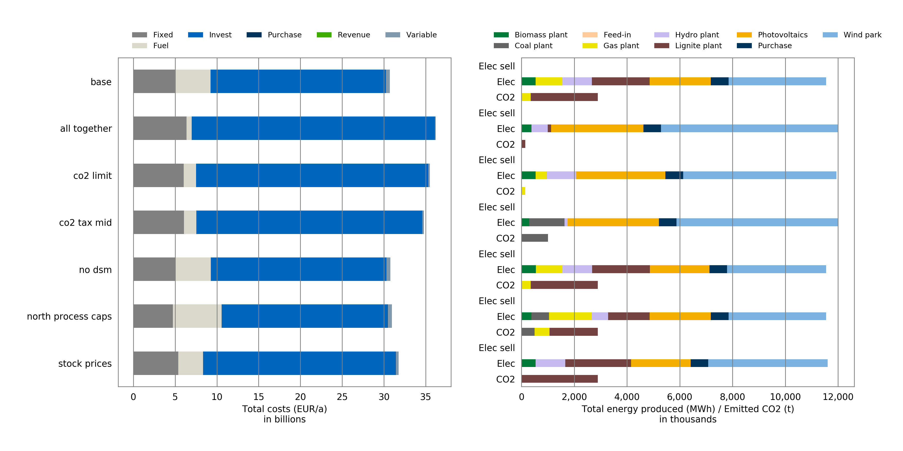
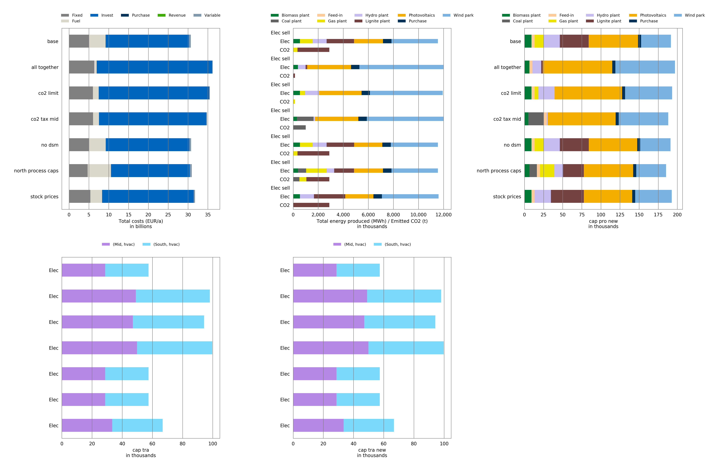

===================
Tutorial to comp.py
===================
This tutorial is a commented walk-through through the script ``comp_h5.py``.

Running a comparison
====================
This section will provide a brief overview of the functionality of the script and
include useful information for the user.
For a more comprehensive explanation refer to the :ref:`in-depth section <in-depth>`.

.. _configuration:

Configuration
-------------
 ::

    CONFIG = {'COMP_NAME_OUT': 'comparison',
              'FILTER': ['t', 'sit'],
              'KEEP_ZERO': False,
              'KEEP_SMALL_VALUES': False,
              'RESULT_FILE_PATTERN': 'scenario_*.h5',
              'SUBPLOTS': ['costs',
                           'e_pro_out',
                           'cap_pro_new',
                           'cap_tra',
                           'cap_tra_new']}

Basic configuration options are stored in the ``config`` dictionary,
making it easy to adjust the comparison.
The user is free to modify this to his/ her needs.

*It is recommended to change this part of the script, before making any modification to
the rest of the script.*

* ``'COMP_NAME_OUT'`` contains the base filename for resulting comparison plots.
  The comparison will be saved as ``.pdf`` and ``.png``.

* ``'FILTER'`` contains all indices that are to be summarized. (Default: time
  and sit(?))

* ``'KEEP_ZERO'``: Zero values hold little value when actually plotted as
  "empty graphs". This option offers the possibility to dismiss/discard those values.

* ``'KEEP_SMALL_VALUES'``: Small values in plots cannot be distinguished from zero
  values. This option can treat values that are comparably small
  (0.01% to the max value) like zero values.

* ``'RESULT_FILE_PATTERN'`` is the filename pattern of result files,
  from which data will be drawn.

* ``'SUBPLOTS'`` is a list of subgroups which are to be compared. Each element will
  correspond to one plot.

.. _plot_label:

::

    PLOT_LABEL = {'costs': 'Total costs (EUR/a)',
                  'e_pro_out': 'Total energy produced (MWh) / Emitted CO2 (t)'}

The ``PLOT_LABEL`` dictionary contains pre-defined plot descriptions (x-axis)
for specific subplots. Any additions by the user are welcome.

Input/Output path
-----------------
(For the next step, it is best to read the script from the back.)::

    if __name__ == '__main__':
        directories = sys.argv[1:]

        # defaults to this option if no paths were given
        if not directories:
            directories = [get_most_recent('result')]

        for path in directories:
            result_files = get_result_files(path)
            filename = os.path.join(path, CONFIG['COMP_NAME_OUT'])
            compare_scenarios(list(result_files), filename)

If called by itself, the `comp.py` script will default to ``'/result'`` as the
target directory. Files that are located in that directory and match the
file pattern in the :ref:`config <configuration>` dictionary will be taken into
consideration for the comparison.

It is possible to take data from different or even multiple directories. In that case, the user
has to pass the paths as additional arguments when executing `comp.py``.

The comparison results will be saved in the same folder as the input files.

.. note::
    :func:`compare_scenarios` will be applied to each directory separately, and therefore create
    individual comparisons *for* and *in each directory*

Processing data
---------------
.. note::
    The following part might be of little practical importance for the user
    but is explained nonetheless in order to convey a rough understanding.

This section is where the main "data processing" happens.::

    for group in CONFIG['SUBPLOTS']:
        totalsum[group] = pd.DataFrame()
        # summarize, clean up, merge
        for key in scenarios:
            single = scenarios[key]._result[group]
            single = summarize(single)
            single = remove_zero(single, keep=True)
            single = pd.DataFrame(single)
            single.columns = [key]
            totalsum[group] = pd.concat([totalsum[group], single], axis=1,
                                        sort=True)

*(This code snippet is taken from :func:`compare_scenarios`)*

Any data, when first taken out of a result file, usually contains
redundant information and needs to be cleaned up for our comparison needs.
:func:`summarize`, :func:`remove_zero`, :func:`pd.concat` help to bundle the data and
put them together, whilst also retaining the information from which
scenario they come from.

Example for ``'costs'`` subplot:

1. *Single* :class:`DataFrame` *; taken from* ``'base'`` *scenario*

============= ============
cost_type
============= ============
Invest        2.101330e+10
Fixed         4.963504e+09
Purchase      0.000000e+00
Variable      4.598188e+08
Environmental 0.000000e+00
Fuel          4.268014e+09
Revenue       0.000000e+00
============= ============

2. *Single* :class:`DataFrame` *cleaned up and appended "base" to column*

============= ============
\             base
------------- ------------
cost_type
============= ============
Invest 	      2.101330e+10
Fixed 	      4.963504e+09
Variable 	  4.598188e+08
Fuel 	      4.268014e+09
============= ============

3. *All scenarios merged to* ``totalsum`` :class:`DataFrame` *; decimals shifted*

*Note: Order of scenarios is reversed in actual DataFrame.*

======== ============ ============= ============= =============== ============= =================== ==============
\        base         all together  co2 limit     co2 tax mid     no dsm        north process caps  stock prices
======== ============ ============= ============= =============== ============= =================== ==============
Fixed    4963.504102  6371.855417   6016.407335   6068.033827     5001.973415   4717.575258 	    5388.947590
Fuel     4268.014105  619.641021    1489.522330   1476.102443     4271.007457   5852.468316         2968.029512
Invest 	 21013.303061 2912.683966   27806.962192  27059.082618    21044.455684  19874.281868 	    23047.504292
Variable 459.818764   94.782052     176.448662    169.728647      460.805951    512.300876          339.877717
======== ============ ============= ============= =============== ============= =================== ==============

..

The data drawn from the result files are in a form similar to a **pandas Series**.
All their indices are stacked to one side of the :class:`DataFrame`. Each result file
represents one scenario. The script will exclusively work with data,
that was produced with the ``urbs.saveload.py`` module.

.. _short_plot:

Plotting
--------
This section explains the code primarily responsible for the plots::

    num = len(CONFIG['SUBPLOTS'])  # number of subplots
    height = int(num**0.5)
    width = int(num/height)+num % height
    figure, axes = plt.subplots(nrows=height, ncols=width, figsize=(7*width,
                                7*height), dpi=250, tight_layout={'pad': 3})

A grid for subplots is prepared with :func:`plt.subplots`. The ``height`` (number of rows) and
``width`` (number of columns) depend on the number of subplots that were defined in
:ref:`config <configuration>`. The plots will be arranged in a single row for 1~3 subplots,
in two rows for 4~8 plots, in 3 rows for 9~15 plots, etc.

.. note::
    In case the comparison layout is inadequate, the DPI and layout distribution may be modified here.

::

    if height == 1:
        for num, group in enumerate(CONFIG['SUBPLOTS']):
            plot[num] = totalsum[group].plot.barh(stacked=True, ax=axes[num],
                                                  color=colors[group])
        figure.subplots_adjust(wspace=.0)

    else:
        key = list(totalsum.keys())
        count = 0
        for row in range(height):
            for col in range(width):
                if count < len(key):
                    plot[count] = totalsum[key[count]].plot.barh(stacked=True,
                                                                 ax=axes[row][col],
                                                                 color=colors[key[count]])
                    count += 1
                else:
                    figure.delaxes(axes[row][col])
        figure.subplots_adjust(hspace=.250, wspace=.0)

This is the actual plotting part.  :func:`.plot.barh` creates a horizontal bar plot for each entry in
``SUBPLOTS`` and assigns it to the grid (``ax=``). The script handles single row
and multi-row grids separately because ``axes`` are two-dimensional arrays in the latter case.

.. note::
    The user has the option to adjust the space between individual subplots by modifying
    :func:`.figure.subplots_adjust`.

The end result will look similar to this:

   (Comparison of ``costs`` and ``e_pro_out``)

   (Comparison with 5 subplots: ``costs``, ``e_pro_out``, ``cap_pro_new``, ``cap_tra`` and ``e_tra_new``)

.. _in-depth:

comp.py (in-depth)
==================

This write-up is primarily addressed to the ones who wish to do more advanced modifications,
which the :ref:`config <configuration>` could not offer.
The following sections will go through the comp.py script as a whole, from top to bottom, and will provide a slightly
more technical description of the script compared to previous explanations.

Imports
-------

::

    import collections
    import sys
    import glob
    import os

    import pandas as pd
    import urbs as urbs

    import matplotlib.pyplot as plt
    import matplotlib.ticker as tkr

Several packages are included:

* `collections`_: built-in python module; included for :class:`OrderedDict`

* `sys`_: built-in python module; included for `sys.argv`

* `glob`_: built-in python module; included for :func:`glob.glob`

* `os`_: built-in python module; included for its `os.path` submodule

* `pandas`_: a library for data structures and data analysis tools; mainly included for its
  :class:`DataFrame` data structure

* `urbs`_: the directory which includes modules, whose functions are used to
  load `.h5` files containing all the data

* `matplotlib.*`_: a 2D plotting library; necessary to plot the comparison

.. _collections: https://docs.python.org/2/library/collections.html
.. _sys: https://docs.python.org/3/library/os.html
.. _glob: https://docs.python.org/3/library/glob.html
.. _os: https://docs.python.org/2/library/os.html
.. _pandas: https://pandas.pydata.org/
.. _matplotlib.*: https://matplotlib.org/
.. _urbs: https://github.com/tum-ens/urbs

Configuration dictionary
------------------------
Please refer to :ref:`configuration`

.. note::

    For settings missing from :ref:`configuration <configuration>`, that have to be adjusted often, you
    may consider exporting/outsourcing them to this dictionary.
    It would be advantageous to shift most, if not all, customizable options out of the major functions.

Functions
---------

Plotting/Utility
^^^^^^^^^^^^^^^^
These functions improve the readability of the final plots

::

    def dec_name(value):
        alias = {1e3: 'thousand',
                 1e6: 'million',
                 1e9: 'billion',
                 1e12: 'trillion',
                 1e15: 'quadrillion'}
        try:
            return alias[value]
        except KeyError:
            return value

At one point in the script, the numbers from :class:`DataFrame` are downscaled. (Big/Long numbers are impossible
to read when displayed in a plot). :func:`dec_name` will return that information by adding the name of the decimal
shift to the respective ``SUBPLOTS``. `(e.g. 5,000,000 = 5 millions)`

.. note::

    Add more to this when working with bigger numbers. This function may be modified into a general alias function.
    For example prefixes for SI units.

::

    def gen_text(decimal_dict):
        _temp = decimal_dict
        text = {}
        for key in _temp:
            try:
                text[key] = PLOT_LABEL[key]
            except KeyError:
                text[key] = key.replace('_', ' ')
            text[key] += f"\nin {dec_name(_temp[key])}s"
        return text

:func:`gen_text` takes the dictionary which contains the decimal shifting information and returns a ``text`` dictionary
which contains the complete plot descriptions. The dictionary keys are the elements of ``CONFIG['SUBPLOTS']``.

If predefined, the text strings from ``PLOT_LABEL`` are used. Else,
the label will default to the subplot name. `(e.g. "<basestring> in thousands/millions/billions")`

.. note::

    Go to :ref:`CONFIG>PLOT_LABEL <plot_label>` to add more custom labels.

Files & Pathing
^^^^^^^^^^^^^^^
::

    def get_most_recent(search_dir):
        entries = glob.glob(os.path.join(search_dir, "*"))
        entries.sort(key=lambda x: os.path.getmtime(x))
        return entries[-1]

:func:`get_most_recent` returns the most recently modified entry from a given directory.
This function is used in the default case that no additional arguments were given
during the execution of the script.

:func:`glob.glob` searches the whole directory (``search_dir``) and returns the relative
path to every file/folder found. (In this case: files matching the ``*`` pattern, which is all)
That list of results will be saved in ``entries``.

Once the list is sorted with the help of :func:`os.path.getmtime` (returns the "last modified" timestamp),
the last entry of the list is returned, which equals the entry with the most recent "last modified" time.

::

    def get_result_files(folder_dir):

        pattern = os.path.join(folder_dir, CONFIG['RESULT_FILE_PATTERN'])
        return sorted(glob.glob(pattern))

:func:`get_result_files` returns a list of all **result files** in the path ``folder_dir``.

In this section :func:`glob.glob` is called with ``pattern``, which is derived from the path given ``folder_dir``
and the pattern previously defined in ``CONFIG['RESULT_FILE_PATTERN']``

The list is later used as ``result_files`` in :func:`compare_scenarios`

DataFrame related
^^^^^^^^^^^^^^^^^
.. tip::

    In ``comp.py``, this function is never called with a specific **key** as an argument and will consequently use the
    default keys provided from ``CONFIG['FILTER']`` (:ref:`configuration`). Use :func:`summarize` with
    a second argument to modify the data to your needs. Alternatively, make adjustments in
    :ref:`compare_scenarios() - Processing <comp_proc>`

::

    def summarize(dataframe, key='default'):
        if key == 'default':
            df = dataframe
            for item in CONFIG['FILTER']:
                df = summarize(df, item)
            return df

        if key in dataframe.index.names:  # does it exist?
            levels = len(dataframe.index.names)  # unstack()-able levels
            indexNames = dataframe.index.names
            attempt = 0
            new = dataframe
            try:
                while key in indexNames and attempt < levels:
                    new = dataframe.unstack(attempt)
                    attempt += 1
                    indexNames = new.index.names
            except:
                pass
            return new.sum(axis=1)
        return dataframe

Takes a :class:`DataFrame` as an argument and one **key** (string) as an optional second.
In case that no key was given during the call, the function will repeat itself with the keys specified in
``CONFIG['FILTER']``.

.. note::

    The :class:`DataFrame` argument must have all indices stacked to one side for this to work. Dataframes in
    `urbs`_ usually meet this requirement by default. If this changes, this function will need to be modified
    to do that manipulation before proceeding with the original tasks.

``levels`` is an integer, telling us how many indices the :class:`DataFrame` has, and therefore, how many
:func:`unstack`-able levels it has. (A ``pandas.Series`` is handled very similarly to a :class:`DataFrame`,
but only has one index level and cannot use :func:`unstack`.

Inside the while loop, the function tries to extract the **key** out of the index list by
repeatedly using :func:`unstack` (with different levels) on the original :class:`DataFrame`.
Once found, it summarizes the columns, which consequently removes the previously mentioned key.
(``new.sum(axis=1)`` should have no effect on the original :class:`DataFrame`,
as it should have but one column.)

The function will always first check whether the **key** exists in the :class:`DataFarame`.
If not found, the function will skip to the end and therefore return the original :class:`DataFrame` without any
modifications.

::

    def remove_zero(dataframe, cut=0.001, keep=CONFIG['KEEP_SMALL_VALUES']):
        if not keep:
            dataframe[abs(dataframe) < (dataframe.max().max()*cut)] = 0
        if isinstance(dataframe, pd.core.series.Series):
            dataframe = dataframe[(dataframe != 0)]
            return dataframe
        dataframe = dataframe[(dataframe.T != 0).any()].T
        dataframe = dataframe[(dataframe.T != 0).any()]
        return dataframe.T

:func:`remove_zero` takes a :class:`DataFrame` and manipulates it by removing redundant
zeroes first and foremost. Optionally it can also remove very small values.

Depending on ``keep``, which can be specified in the :ref:`configuration`, all small values in the
:class:`DataFrame` below the threshold ``cut`` (default: 0.1%) will be set to zero, effectively treating
them the same as the original zeroes.

``dataframe[(dataframe.T != 0).any()]`` removes any zero columns by using a boolean :class:`DataFrame` as a mapping template
to identify cells containing non-zeroes and check for whole columns with ``False``.

This is repeated for rows by transposing the :class:`DataFrame` with ``T``.
This is later reversed in the ``return`` line

.. _comp:

compare_scenarios()
-------------------

Loading
^^^^^^^
::

    def compare_scenarios(result_files, output_name):
        scenario_names = [os.path.basename(rf)  # drop folder names, keep filename
                          .replace('scenario_', '')  # drop 'scenario_' prefix
                          .replace('.h5', '')  # drop file extension
                          .replace('_', ' ')  # replace _ with spaces
                          for rf in result_files]

        scenarios = collections.OrderedDict()
        buffer = collections.OrderedDict()

        # loads scenario h5 files into dictionary for easier handling
        for rf, name in zip(result_files, scenario_names):
            buffer[name] = urbs.load(rf)

        # sorts scenario dict in descending order with 'base' scenario at the end
        order = list(buffer.keys())
        order.sort()
        if 'base' in order:
            order.insert(0, order.pop(order.index('base')))
        order.reverse()
        for i in order:
            scenarios[i] = buffer[i]

        totalsum = {}
        decimal = {}
        colors = {}

The default arguments for ``result_files`` and ``output_name`` can be seen :ref:`here <main>`.

Variable ``scenario_names`` is a list, which contains the names of all scenarios as
its name suggests. The names are taken from the files of ``result_files``, by dropping
their paths and trimming their filenames.

Variable ``scenarios`` is an ordered dictionary containing the loaded ``result_files`` with their respective
simplified scenario names as key.

Variable ``buffer`` is another ordered dictionary (similar to ``scenarios``) and variable ``order`` is a list
containing the keys of ``buffer``. Both are temporarily used to help to sort ``scenarios``. The dictionary is sorted
alphabetically with ``'base'`` being first if that scenario exists. (The sorting is in descending order; this, with the
default order for plotting being ascending from bottom to top, will result in ``base`` being at the top.)

.. note::

    :func:`urbs.load` is a function from `urbs`_, which takes a path, loads the respective ``.h5`` file and
    returns it in an easier to handle form. For further information on that data structure, refer to
    ``urbs.saveload.py`` of the `urbs`_ module.

Other dictionaries::

        totalsum = {}
        decimal = {}
        colors = {}

``totalsum``, ``decimal``, and ``colors`` are dictionaries with ``SUBPLOTS`` as keys.

* ``totalsum`` contains the cleaned up and merged :class:`DataFrame` of all scenarios.

* ``decimal`` contains by how many decimals the values of a :class:`DataFrame` have been shifted.

* ``colors`` contains the color codes for the final plots.

.. _comp_proc:

Processing
^^^^^^^^^^
::

    for group in CONFIG['SUBPLOTS']:
        totalsum[group] = pd.DataFrame()
        # summarize, clean up, merge
        for key in scenarios:
            single = scenarios[key]._result[group]
            single = summarize(single)
            single = remove_zero(single, keep=True)
            single = pd.DataFrame(single)
            single.columns = [key]
            totalsum[group] = pd.concat([totalsum[group], single], axis=1,
                                        sort=True)
        if len(totalsum[group].index.names) > 1:
            totalsum[group] = totalsum[group].unstack()
        totalsum[group] = totalsum[group].T

.. note::

    ``=scenarios[key]._result[group]`` is necessary to access the data we need. This data structure is provided by
    the container class in ``urbs.saveload.py`` of the `urbs`_ module.

The ``single`` DataFrames are summarized
and cleaned up with :func:`summarize` and :func:`remove_zero`. The :class:`DataFrame` is then formatted and
gets it key assigned as a(n) (/additional) column index to retain the scenario information.

After being merged together into ``totalsum[group]`` :class:`DataFrame` (appending with
pandas native :func:`pd.concat` function), ``totalsum[group]`` is unstacked as necessary.

The following code is still part of the previous ``for``-loop::

        # thousands
        shf = 0
        while totalsum[group].max().max() > 10**(shf+4):
            shf += 3
        totalsum[group] /= (10**shf)
        decimal[group] = (10**shf)

This part shifts the decimals of a ``totalsum`` :class:`DataFrame`, resulting in numbers smaller
than five digits. This information is saved in the ``decimal`` dictionary for later use when
:ref:`plotting <comp_plot>`.

 ::

    # colors
    # to_color() cannot handle things like tuples, therefore str()
    colors[group] = [urbs.to_color(str(com)) for com in totalsum[group]]

:func:`urbs.to_color` provides us with a list of color codes, which are predefined for different commodities.
Undefined commodities will receive uniquely generated colors.
This is saved in ``colors`` dictionary for later use when :ref:`plotting <comp_plot>`.

.. note::

    :func:`urbs.to_color` can only match single strings. When no match is found it will generate a random
    color code by using hashing algorithms. All values of ``com`` are string by default, but sometimes come
    in tuples. To avoid any problems caused by this we use
    :func:`str` to convert these tuples into unique strings for :func:`urbs.to_color` to work with.

.. _comp_plot:

Plotting
^^^^^^^^
:ref:`Please also refer to plotting section above. <short_plot>`

Preparing the figure::

    num = len(CONFIG['SUBPLOTS'])  # number of subplots
    height = int(num**0.5)
    width = int(num/height)+num % height
    figure, axes = plt.subplots(nrows=height, ncols=width, figsize=(7*width,
                                7*height), dpi=250, tight_layout={'pad': 3})
    plot = [None]*num

:func:`plt.subplots` provides a simple option to create a grid for several subplots
``height`` and ``width`` are allocated depending on the number of ``SUBPLOTS``.
The individual plots are later saved in the list ``plot`` for easier access.

.. note::

    ``figsize`` and ``dpi`` in :func:`plt.subplots` should be adjusted to your needs. The calculation for ``height``
    can be completely replaced depending on the the desired final format.

Filling the subplots::

    if height == 1:
        for num, group in enumerate(CONFIG['SUBPLOTS']):
            plot[num] = totalsum[group].plot.barh(stacked=True, ax=axes[num],
                                                  color=colors[group])
        figure.subplots_adjust(wspace=.0)

    else:
        key = list(totalsum.keys())
        count = 0
        for row in range(height):
            for col in range(width):
                if count < len(key):
                    plot[count] = totalsum[key[count]].plot.barh(stacked=True,
                                                                 ax=axes[row][col],
                                                                 color=colors[key[count]])
                    count += 1
                else:
                    figure.delaxes(axes[row][col])
        figure.subplots_adjust(hspace=.250, wspace=.0)

Depending on the last step, the figure will have one or multiple rows of subplots and therefore
have a one or two-dimensional grid (in that case: ``axes`` is be a two-dimensional array).
The empty subplots will be filled from left to right (and top to bottom), while any unused subplots
are deleted with :func:`figure.delaxes`.

*Note: Colors from colors are applied here by giving a list of colors codes to the* ``color``
*argument of* :func:`plot.barh`

.. note::

    :func:`figure.subplots_adjust` can be adjusted without any further consequences. Other general formatting
    steps can be added here as well if you wish to differentiate between single and multi row figures

Plot Appearance
^^^^^^^^^^^^^^^
General plot appearance modifications

::

    # Labeling
    plot_text = gen_text(decimal)
    first = True
    for subplot, group in zip(plot, CONFIG['SUBPLOTS']):
        subplot.set_xlabel(plot_text[group])
        if not first:
            try:
                subplot.set_yticklabels(totalsum[group].index
                                        .get_level_values(1))
            except:
                pass
        first = False

The x-labels for each subplot are generated with :func:`gen_text`.
All subplots are sorted by scenarios, making multiple mentions of the scenario names obsolete.
Therefore all subplots will drop their scenario names as y-label, apart from the first subplot,
and use an alternative level of index as a label instead. *(As far as possible)*

.. note::

    The y-labels have only been tested with plots showing simple commodities or production sites.
    This function will need adjustments for more complex or different data.

(Inside the same ``for``-loop)::

    # Formatting/Legend
    # To Do: Change the following for better readability
        subplot.set_ylabel('')
        plt.setp(list(subplot.spines.values()), color=urbs.to_color('Grid'))
        subplot.yaxis.grid(False)
        subplot.xaxis.grid(True, 'major', color=urbs.to_color('Grid'),
                           linestyle='-')
        subplot.xaxis.set_ticks_position('none')
        subplot.yaxis.set_ticks_position('none')

        # 1,000,000
        group_thousands = tkr.FuncFormatter(lambda x,
                                            pos: '{:0,d}'.format(int(x)))
        subplot.xaxis.set_major_formatter(group_thousands)

        # legend
        lg = subplot.legend(frameon=False, loc='upper center',
                            ncol=5, bbox_to_anchor=(0.5, 1.1),
                            fontsize='small')
        plt.setp(lg.get_patches(), edgecolor=urbs.to_color('Decoration'),
                 linewidth=0)

Adjustments to the grids, legend, and displayed number format are repeated for every subplot.

.. note::

    Grouping thousands can be omitted as the numbers have been shifted to be quite small in general.
    (See :ref:`DataFrame Processing <comp_proc>`)

Saving Files
^^^^^^^^^^^^
::

    fullname = f"{output_name}_{len(CONFIG['SUBPLOTS'])}p"
    for ext in ['png', 'pdf']:
        plt.gcf().savefig(f"{fullname}.{ext}")
        print(f"File saved: {fullname}.{ext}",)

An extra step is taken with the variable ``fullname`` which includes the number of subplots for the comparison.

.. note::

    The user is free to modify or even omit ``fullname`` completely. In case of the latter, change ``fullname`` inside
    the ``for``-loop to ``output_name``

.. note::

    Add more file types to the ``['png', 'pdf']`` list as necessary. ``png`` and ``pdf`` are chosen as default,
    as they cover both, pixel raster and vector type imaging.

.. note:: :meth:`~matplotlib.figure.Figure.savefig` has some more interesting
   arguments. For example ``dpi=600`` can be used to create higher resolution
   raster output for use with printing, in case the preferable vector images
   cannot be used. The filename extension or the optional ``format`` argument
   can be used to set the output format. Available formats depend on the used
   `plotting backend`_. Most backends support png, pdf, ps, eps and svg.

.. _plotting backend:
    http://matplotlib.org/faq/usage_faq.html#what-is-a-backend

.. _main:

main() - Pathing
----------------
::

    if __name__ == '__main__':
        directories = sys.argv[1:]

        # defaults to this option if no paths were given
        if not directories:
            directories = [get_most_recent('result')]

        for path in directories:
            result_files = get_result_files(path)
            filename = os.path.join(path, CONFIG['COMP_NAME_OUT'])
            compare_scenarios(list(result_files), filename)

Variable ``directories`` is a list of directories which are to be considered
for the comparison process. It contains the additional arguments
if any were given when the script was executed. In case no additional arguments
exist, ``directories`` defaults to the most recent directory in ``'/result'``.

Variable ``result_files`` is the list of files to be analyzed.

Variable ``filename`` contains the filename for the resulting comparison files, including their path.

:func:`compare_scenarios` is the core function of the comparison script.
It is responsible for handling, processing and plotting the data. (See :ref:`compare_scenarios <comp>`)

