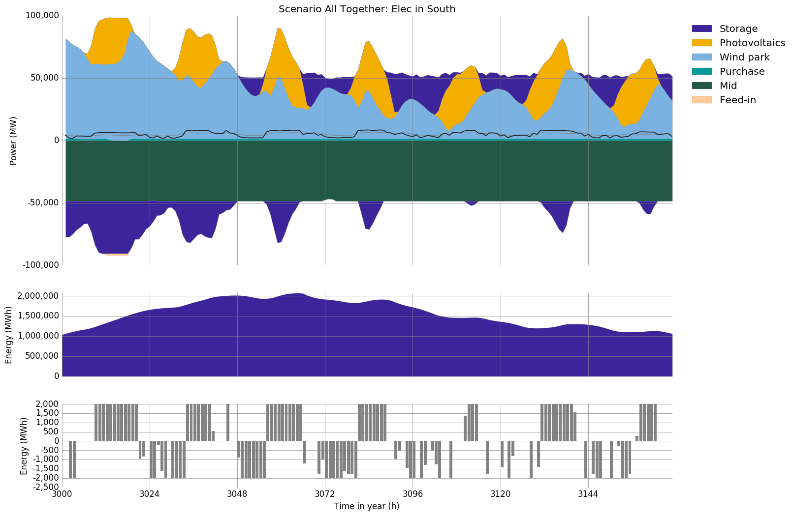
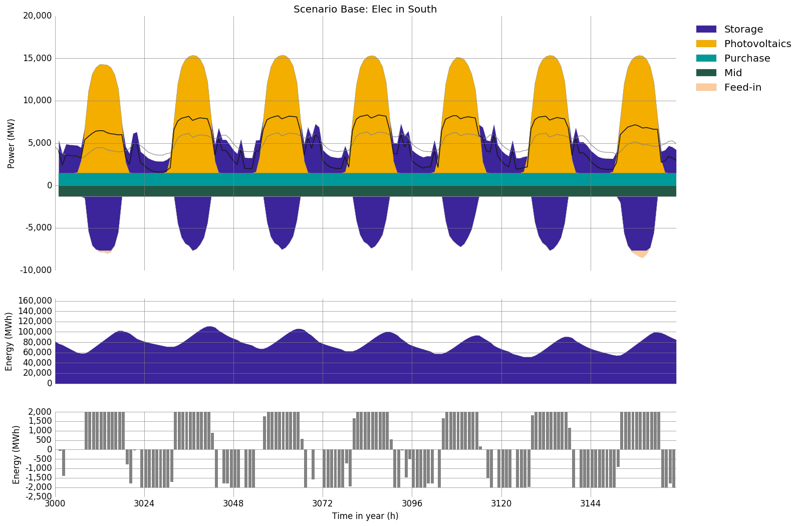

.. module:: urbs

Demand Side Management Documentation
************************************

This documentation explains the Demand Side Management feature of urbs. 
With it, one can model time variant Demand Side Management Up/Downshift 
in a concrete energy system, for example, smart grid of a city.

Introduction
============
The DSM up/downshifts are closely related to commodities,
which are given by default in the urbs with their energy content (MWh). 
The size of the modelled market has to be considered small relative to 
the surrounding market. To use this feature, the excel input file needs 
an additional **Demand Side Management** sheet with the five parameters 
containing the columns ``delay``, ``eff``, ``recov``, ``cap-max-do`` and 
``cap-max-up``, which are used in DSM constraints as technical parameters. 
For a more detailed description of the implementation have a look at the 
mathematical definitions in the Mathematical Documentation, section 
:ref:`sec-dsm-constr`.

Exemplification
===============

This section contains prototypical scenarios illustrating the system 
behaviour with time variant DSM up/downshifts. 
In this part there is an island as an example named ``Greenland``, which 
composed of three sites ``Mid``, ``North``, and ``South``. Between the 
three sites most of the electricity from ``South`` has to be transported 
to supply ``Mid``. The electricity of ``North`` is relatively independent 
of the other two sites.

When do the electricity DSM downshifts appear in the process?

- it is *necessary* to constraint the whole system with DSM downshifts, if 
  the demand is greater than the total output capacity.

- it is *profitable* to constraint the whole system with DSM downshifts, if 
  the commodity begin to show upward trend till the peak value.

When appears the electricity DSM upshifts in the process?

- it is *possible* **and** *profitable* to constraint the whole system with DSM
  upshifts, if the demand is lesser than the total output capacity **and** 
  the commodity begin to show downward trend till the valley value.

High Maximal Up/Downshift Capacity 
^^^^^^^^^^^^^^^^^^^^^^^^^^^^^^^^^^

All process, transmission and storage capacities are predetermined and 
constant.

The following scenario illustrates the energy balance of the ``South`` of 
``greenland``. It has a demand of 50-100 GW that is supplied by a 50 GW 
photovoltaics plant and a 50 GW wind plant. In addition a 50 GW transmission 
cable exports electricity, which connects the ``Mid`` of island with the grid 
of ``South``. Both capacities and prices are fix. Because of the meteorological 
effects on Photovoltaics plants, the timesteps began at the 3000th hour of the 
year, which was also the beginning of the summer.

.. csv-table:: Scenario All Together: Elec in South
   :header-rows: 1
   :stub-columns: 1
   
   Process,        eff, inst-cap, inst-cap-out,  fuel-cost, var-cost, total-var-cost
   Photovoltaics, 1.00,        0,      50000,            0,        0,              0 
   Wind plant,    1.00,        0,     100000,            0,        0,              0
   Purchase,      1.00,        0,       1500, **15/45/75**,        0,       15/45/75
   Feed-in,       1.00,        0,       1500, **15/45/75**,        0,       15/45/75

.. csv-table:: DSM in South
   :header-rows: 1
   :stub-columns: 1

   Site,   Commodity, delay,  eff, recov, cap-max-do, cap-max-up
   South,  Elec,         16, 0.90,     1,       2000,       2000

The modelled timesplan lasts 7 days with five parameters from DSM sheet in 
``greenland-south.xlsx``. In the first ten hours of day 1 the electricity power
is at a high level, because the supply is much less than the demand. So the 
DSM begins with downshifts. But the situation will change into opposite direction 
over time. After the supply exceeds, the demand the DSM upshifts appears to 
take place of downshifts. How much electricity can the photovoltaics plants and 
awind plants generate all depending on the weather conditions. The wind plants 
works the whole day 24 hours, as long as the wind blows strongly enough. But 
photovoltaics plants generates electricity only in the daytime, that is why the
parameter ``delay`` is set to 16 hours. It just coincides the time in one day, 
that is covered by the sunshine. Before the second day the wind blows strongly 
enough, so that the surplus of wind plant generated electricity is converted 
into storage. From the 3rd day the wind production decreases, and the electricity of 
storage has to be taken out to meet the demand. At the midnight of the 5th day 
electricity capacity come to the lowest point of all, and the output and input 
keep nearly in balance.  Not only the frequency of scenario_base up/downshifts, 
but also the amount of times of up/downshifts will decrease correspondingly. 
There is relative more volatility of electricity capacity in the seven days 
simulation than it without DSM.

	

If the **commodity stock prices**, **global CO2 limit** and **maximum installable capacity** 
in ``runme.py`` are not changed, and just only consider the ``scenario_base``, it 
will be more clearly to show how the DSM affects the electricity commodities.

.. note::

    For trial e.g. of the result of higher Demand Side Management this
    :download:`greenland-south.xlsx <greenland/greenland-south.xlsx>`
    is the input file used for this scenario.

	
Low Maximal Up/Downshift Capacity
^^^^^^^^^^^^^^^^^^^^^^^^^^^^^^^^^
All process, transmission and storage capacities are predetermined and constant.

For the second scenario, the ``North`` of greenland will replaced the ``South``.
Compared to the ``South``, the electricity supply of ``North`` is relatively 
simple and independent. It has a demand of 10000-15000 MW, and the supply is 
dominated by wind plants. Additionally there is about 2500 MW needed to be 
provided by Purchase.

.. csv-table:: Scenario All Together: Elec in North
   :header-rows: 1
   :stub-columns: 1
   
    Process,        eff, inst-cap, inst-cap-out,    fuel-cost, var-cost, total-var-cost
    Photovoltaics, 1.00,        0,         3000,            0,        0,              0 
    Wind plant,	   1.00,        0,        15000,            0,        0,              0
    Gas plant,     0.60,        0,            0,           27,     1.60,          28.60
    Purchase,      1.00,     1500,         1500, **15/45/75**,        0,       15/45/75
    Feed-in,       1.00,     2500,         2500, **15/45/75**,        0,       15/45/75
	

.. csv-table:: DSM in North
    :header-rows: 1
    :stub-columns: 1
	
	Site,   Commodity, delay,  eff,   recov,  cap-max-do, cap-max-up
	North,  Elec,          8, 1.00,       1,         500,        500
	
	
The modelled timesplan lasts also 7 days with five parameters from DSM sheet in 
``greenland-north.xlsx``.  The electricity supply of ``North`` is dominated by 
wind plants. The wind plants works for 24 hours in one whole day, and the wind 
power strong or weak has nothing to do with the change of time. So the parameter 
``delay`` is set to 8 hours. Because the peak value of the output of ``North`` 
is just close to 15 GW, the ``cap-max-do`` and ``cap-max-up`` are set to 500 MW, 
which is a quarter of South's. The electricity in the first four days, which is 
generated by wind plants, keeps at a higher level. That is why the up/downshifts 
appear frequently, regularly, and alternately during this time. But in the last 
three days the wind power gets lower, and the electricity of storage has to be taken 
out to meet the demand. Then during the three days downshifts dominate in most 
case. With DSM up/downshifts intelligent allocation of electricity resources is 
required to avoid the shortage of electricity supply during peak hours and the 
overcapacity in the usual time. 

.. image:: greenland/scenario_all_together-Elec-North-sum.png
    :width: 90%
    :align: center

.. note::

    For trial e.g. of the result of lower Demand Side Management this
    :download:`greenland-north.xlsx <greenland/greenland-north.xlsx>`
    is the input file used for this scenario.

No Maximal Up/Downshift Capacity 
^^^^^^^^^^^^^^^^^^^^^^^^^^^^^^^^
All process, transmission and storage capacities are predetermined and constant.

The last scenario illustrates the energy balance of the ``Mid`` of ``greenland``. 
It has a demand of 50-70 GW that is mostly supplied by a 50 GW transmission, which 
come from ``South``. In addition, a 13 GW wind plant and 16 GW Photovoltaics plant 
has made a contribution to the whole electricity system of ``Mid``.
 

.. csv-table:: Scenario All Together: Elec in Mid
   :header-rows: 1
   :stub-columns: 1

   Process,         eff, inst-cap, inst-cap-out, fuel-cost, var-cost, total-var-cost
   Photovoltaics,  1.00,    15000,        16000,         0,        0,           0.00
   Wind plant,     1.00,        0,        13000,         0,        0,           0.00
   Gas plant,      0.60,        0,         8000,        27,     1.60,          28.60
   Hydro plant,    1.00,        0,         1400,         6,     1.40,           7.40
   Lignite plant,  0.40,        0,        60000,         0,     0.60,           0.60
   Biomass plant,  0.35,        0,         5000,         6,     1.40,           7.40

.. csv-table:: DSM in Mid
   :header-rows: 1
   :stub-columns: 1
   
   Site,   Commodity, delay,  eff,  recov,  cap-max-do, cap-max-up
   Mid,     Elec,      0,    1.00,    1,         0,          0

The ``Mid`` gets so adequate electricity import from the ``South``, that
commodity of the ``Mid`` per unit time is far greater than maximal up/downshifts
capacity. That means it is meaningless for the setting of DSM faced with so
enormous commodity, which is far beyond the controllable range. Supposed that
the ``Mid`` is the city center, the largest energy customer, not the energy
producer, and then there is huge infrastructure inside, such as public traffic,
hospital, and communication system, which have to be supplied for 24 hours one
day. That's why the parameters ``delay``, ``cap-max-do`` and ``cap-max-up`` are
set to 0. It means that there was no more DSM in the electricity system of
``Mid`` to constraint the commodities.

.. image:: greenland/scenario_all_together-Elec-Mid-sum.png
   :width: 90%
   :align: center

.. note::

    For trial e.g. of the result of no Demand Side Management this
    :download:`greenland-mid.xlsx <greenland/greenland-mid.xlsx>`
    is the input file used for this scenario.
