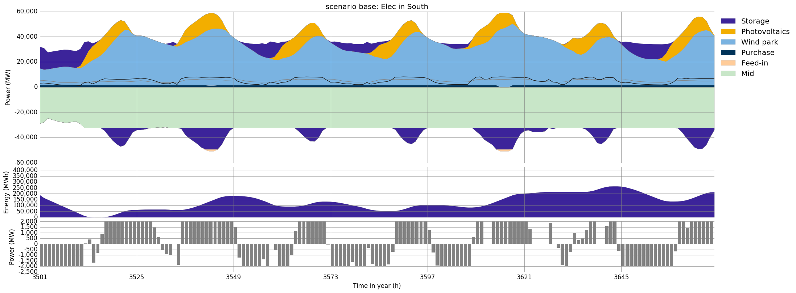
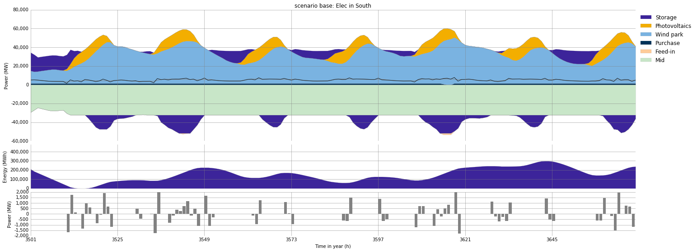
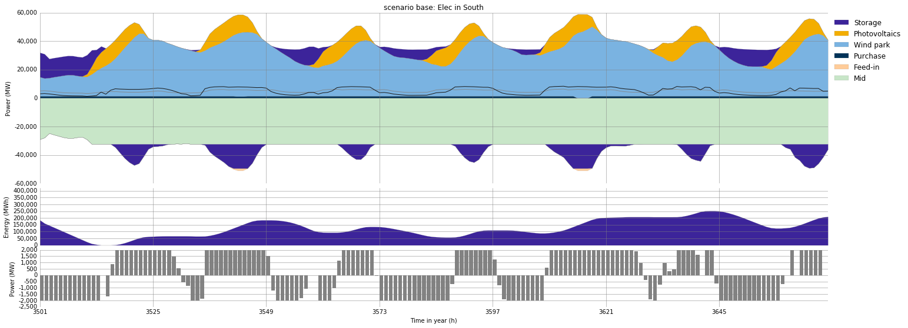
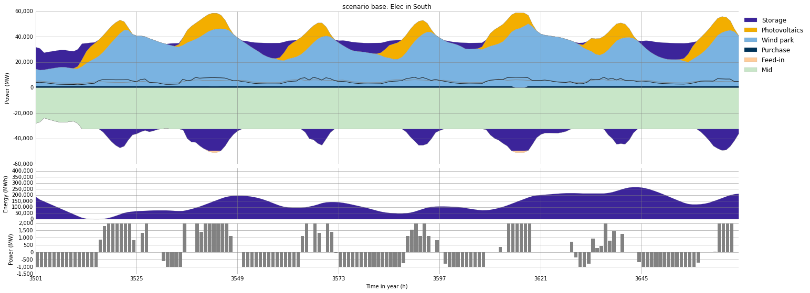
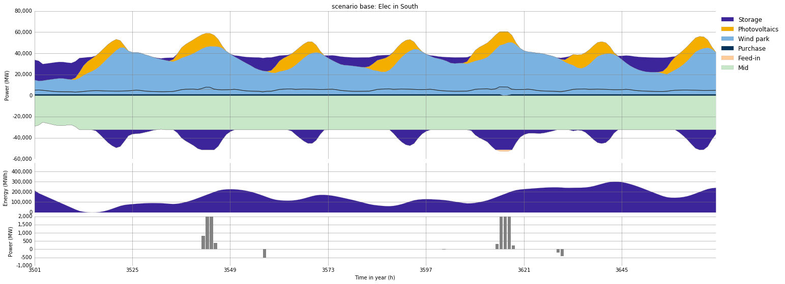
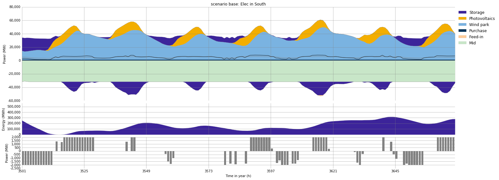

.. module:: urbs

Demand Side Management Documentation
************************************

Demand Side Management (DSM) is a plug-in feature to the energy model urbs. 
DSM targets energy and enviromental efficiency through adapting demand and 
controlled consumption. In this documentation the theory behind the DSM 
formulation and the DSM feature of urbs are explained.

Introduction
------------

The DSM feature of urbs has 2 variables: **DSM upshift** and **DSM downshift**. 
An upshift/downshift in time step :math:`t` means increased/decreased demand for that 
time step respectively. The DSM feature has 5 technical parameters: **delay** (:math:`y_{vc}`), **eff** (:math:`e_{vc}`), 
**recov** (:math:`o_{vc}`), **cap-max-do** (:math:`\overline{K}_{vc}^\text{down}`) and **cap-max-up** (:math:`\overline{K}_{vc}^\text{up}`). 
For detailed information, see :ref:`Demand Side Management Technical Parameters`.
The input excel file of urbs requires an extra DSM sheet, with columns named 
these parameters. This sheet allows DSM to be incorporated in urbs. The DSM feature 
also has to stay within some limitations, which are determined by its formulation. 
For detailed information see :ref:`Demand Side Management Constraints`.

Mathematical Description
------------------------

Within this mathematical description, time steps with default step size of one hour (:math:`\Delta t = 1`)
will be assumed. Before getting started with examples, the :ref:`DSM Variables Rule` should be 
clarified, as it is vital in understanding the workflow of DSM. This rule 
is about the relation between upshifts and their corresponding downshifts. An upshift (multiplied 
with efficiency) must be compensated with multiple downshifts during a certain
time interval. The lower and upper bounds of this time interval are :math:`t - y_{vc}` 
and :math:`t + y_{vc}`. While defining this time interval, another 
time index :math:`tt` is required. Main idea behind this representation is to map every downshift 
to an upshift. With :math:`tt` being included, our downshift process 
can be seen as a matrix with rows/columns corresponding to :math:`t`/:math:`tt` values. 
Mathematically expressed, for every :math:`t`, this rule iterates through 
the defined time interval of DSM downshift process horizontally (:math:`t` is constant, :math:`tt` varies between :math:`t - y_{vc}` and :math:`t + y_{vc}`) 
and sums every component of matrix. Finally the sum must be equal to the upshift 
made in that time step :math:`t`.
   
Another constraint of DSM is the **DSM downward rule** and also helpful realizing the 
matrix representation of time indexes. This rule limits the maximum downshift 
capacity in time step :math:`tt` during a certain time interval. The lower and upper bounds 
of this time interval are :math:`tt - y_{vc}` and :math:`tt + y_{vc}`. For every :math:`tt`, 
the **DSM downward rule** iterates through this time interval vertically (:math:`tt` is constant, 
:math:`t` varies between :math:`tt - y_{vc}` and :math:`tt + y_{vc}`) and sums every component of matrix. The sum may not 
exceed a pre-defined value of maximum downshift capacity.

Example Scenario
^^^^^^^^^^^^^^^^

An example scenario, which lasts 6 days with parameters below clarifies the mathematical 
description above. DSM variables are extracted and their specific values can be seen
in the tables below. In light of mathematical description, tables representing DSM upshift and downshift processes 
can be analysed.

.. csv-table::
   :header-rows: 1
   :stub-columns: 1

   Site,   Commodity, delay,  eff, recov, cap-max-do, cap-max-up
   South,  Elec,         3,     1,     1,       2000,       2000

   
.. csv-table:: **DSM upshift process**
   :header-rows: 1                                                           
   :stub-columns: 1

   :math:`t`,   
   1, 0
   2, 0
   3, 1445
   4, 1580
   5, 2000
   6, 0

   
   

.. csv-table:: **DSM downshift process**
   :header-rows: 1                                                           
   :stub-columns: 1
   
   :math:`t` \\ :math:`tt`,   1,    2,    3,    4,    5,    6
   1,                         0,    0,    0,    0,     ,        
   2,                         0,    0,    0,    0,    0,        
   3,                      1445,    0,    0,    0,    0,    0   
   4,                       555,    0,  555,    0,    0,  470   
   5,                          , 2000,    0,    0,    0,    0
   6,                          ,     ,    0,    0,    0,    0
   
   
   
DSM upshift process is easy to understand, for every time step :math:`t` one upshift 
is made and it can not exceed 2000. The table for DSM downshift process shows, the sum
of horizontally positioned terms for every :math:`t`, is equal to the upshift made at
that time step :math:`t`. The blank spaces in the table are because of delay time 
restriction. For instance, an upshift in :math:`t = 1` may not be compensated with a 
downshift in :math:`tt = 5`, as delay time is equal to 3 in our example. The DSM downward
rule can be noticed in the sum of vertically positioned terms for every :math:`tt`. 
This sum may not exceed 2000 as well, due to given parameters. 
   
   
   
Exemplification
---------------

After the mathematical description of the DSM feature in urbs, running some example 
scenarios will be helpful for visualization of the feature in the output plots. 
The purpose of this exemplification is to display effects of DSM parameter changes 
to the demand curve. Therefore, the input file without any changes is used as the 
original one and every other result is compared with this one for better understanding.

For the exemplification phase, the excel input file :download:`mimo-example.xlsx <../mimo-example.xlsx>` is used and 
the output plot scenario_base-Elec-South-all is regarded.

.. csv-table:: **DSM original**
   :header-rows: 1
   :stub-columns: 1

   Site,   Commodity, delay,  eff, recov, cap-max-do, cap-max-up
   South,  Elec,         16, 0.90,     1,       2000,       2000
   
   

The above scenario is the unchanged, original one and illustrates the energy balance 
of site South for a time period of 7 days. Gray curve in the output plot represents 
the original demand curve and black curve the shifted demand curve. The difference 
between these curves can be explained with the impact of the DSM feature. Even though 
output plots do not give certain information about DSM variables directly, they 
can be informative at some points. For instance, if the gap between black and gray curve, 
in one time step, is equal to cap-max-up, than it is certain that at that time step 
a maximal upshift and no downshifts are made. In every other situation, demand curves 
do not correspond to DSM variables directly. The reason behind is, as expressed 
in mathematical description above, that in one time step tt there can be multiple 
downshifts and an upshift. Therefore, the difference between the demand curves
is equal to difference between upshift and downshifts in that time step and do not 
correspond to a specific upshift or downshift.

.. csv-table:: **DSM with delay=1**
   :header-rows: 1
   :stub-columns: 1

   Site,   Commodity, delay,  eff, recov, cap-max-do, cap-max-up
   South,  Elec,         1, 0.90,     1,       2000,       2000
   
   

   
   

The scenario above illustrates the same site South for the same time period of 
7 days, with just a change of delay time of 1. Delay time is a vital constraint 
of the DSM feature and many real-world DSM applications work with short delay times. 
As seen in the plot above, delay time of 1 hour, directly restricts the DSM 
effectiveness in our example. With reduced demand time, the interval lessens, so demand adaptation 
is impeded. Every upshift in time step :math:`t` is compensated in maximal range of 2 hours ([:math:`t-1`, :math:`t+1`]).
Therefore, usually in critical times just as when photovoltaics start to generate 
electricity, downshifts and upshifts step in. It is the most proper time for the system to
make profit with using the DSM feature, with a delay time of 1.

.. csv-table:: **DSM with delay=24**
   :header-rows: 1
   :stub-columns: 1

   Site,   Commodity, delay,  eff, recov, cap-max-do, cap-max-up
   South,  Elec,         24, 0.90,     1,       2000,       2000
   

	
	
In this example above, delay time is equal to 24. It means DSM cycle has more time 
to compensate an upshift with downshifts. It has an effect of longer periods of 
consecutive upshifts, because of less-tight time restriction. However, very long 
delay times may not be appropriate for real-world DSM applications. For meaningful 
conclusions in many real-world applications delay time :math:`y_{vc}` should be assigned to 
reasonable numbers.

.. csv-table:: **DSM with cap-max-do=1000**
   :header-rows: 1
   :stub-columns: 1

   Site,   Commodity, delay,  eff, recov, cap-max-do, cap-max-up
   South,  Elec,         16, 0.90,     1,       1000,       2000
   

	

The scenario above illustrates the same site South for the same time period of 
7 days, with just a change of cap-max-do of 1000. Time steps, where upshifts 
and downshifts are made, do not vary considerably. However, as the new maximal 
downshift capacity is equal to half of before, the system needs more time to 
compensate an upshift. Effective usage of the DSM feature is through indirect time 
restriction blocked.

.. csv-table:: **DSM with eff=0.10**
   :header-rows: 1
   :stub-columns: 1

   Site,   Commodity, delay,  eff, recov, cap-max-do, cap-max-up
   South,  Elec,         16, 0.10,     1,       2000,       2000
   

Adding the efficiency factor to formula means taking possible losses due to real 
world conditions into consideration. In the example above, the changed parameter 
is efficiency and it is equal to 0.1, which makes the upshift 10 percent efficient. 
That is why less downshifts have to be made in order the compensate upshifts. The
time steps where upshifts are made, are chosen the most profitable ones. This example
with efficiency of 0.1, which is very low, can be interpreted as an application with
technical incoherencies.

.. csv-table:: **DSM with recov=72**
   :header-rows: 1
   :stub-columns: 1

   Site,   Commodity, delay,  eff, recov, cap-max-do, cap-max-up
   South,  Elec,         16, 0.90,    72,       2000,       2000
   

	

	
Recovery time is another extension to model, which prevents DSM process to cycle 
continiously, so that the DSM feature orientates to real-world DSM processes. The 
example scenario above has a recovery time of 72 hours (3 days). Recovery
time limitates the cumulative upshifts for a defined time, which is 72 hours
in this example. As illustrated in the graph, this restricton prevents system
to make upshifts during some time periods and the process becomes non-continious. 
Recovery time is in relation with delay time and have to be chosen reasonably 
regarding to its formula. It is a substantive extension to the model, as many 
real-world DSM processes are not permitted to cycle constantly.

.. csv-table:: **DSM upshift process with recov=72**
   :header-rows: 1                                                           
   :stub-columns: 1

   :math:`t`,   
   3501, 0
   ..., 0
   3513, 0
   3514, 1375
   3515, 0
   3516, 1282
   3517, 2000
   ..., 2000
   3528, 2000
   3529, 0
   ..., 0
   3540, 0
   3541, 1343
   3542, 0
   3543, 2000
   3544, 2000
   3545, 0
   ..., 0
   3572, 0

The DSM upshift process table above, which is for this scenario, expresses the 
restriction of the upshifts explicitly. After time step 3537 the system should
normally start with upshifts and continue until time step 3550 as seen in our original scenario. 
But in this scenario during this time interval just 3 upshifts are made and until time step 3572
no upshifts are on the cards. It is because the maximal limit of :math:`\overline{K}_{vc}^\text{up}y_{vc}`
is reached and no upshifts are allowed for a certain time. 

