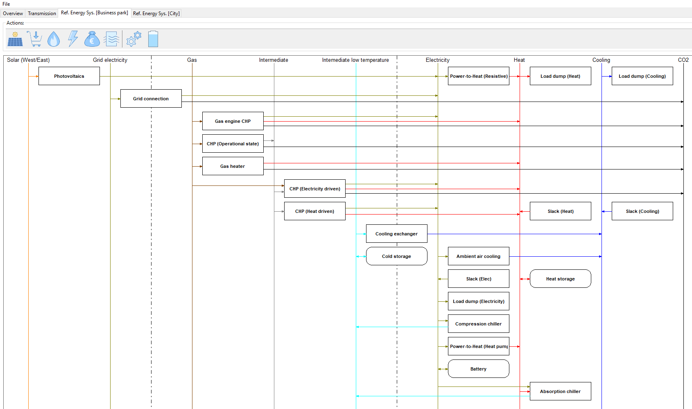
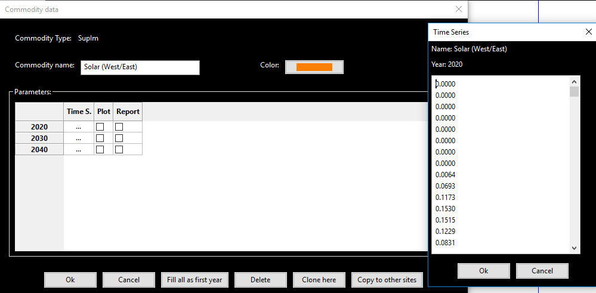
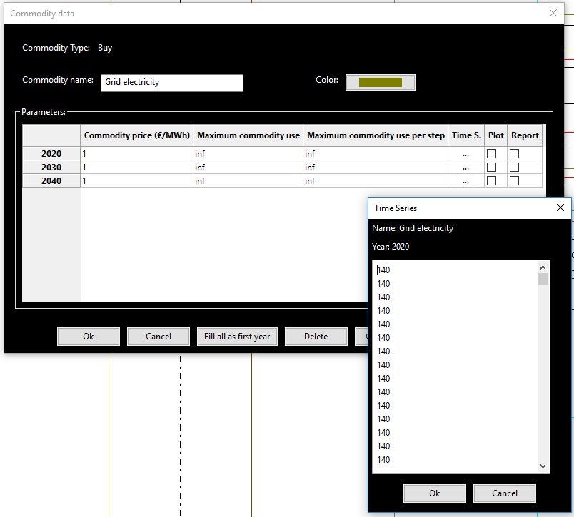
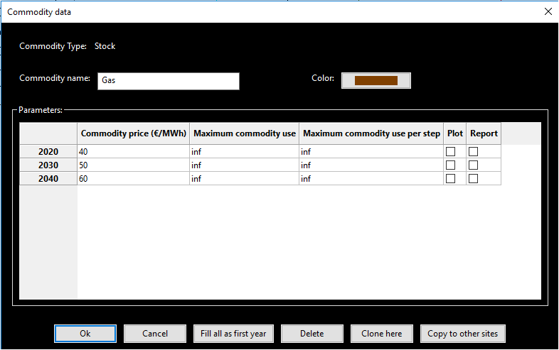
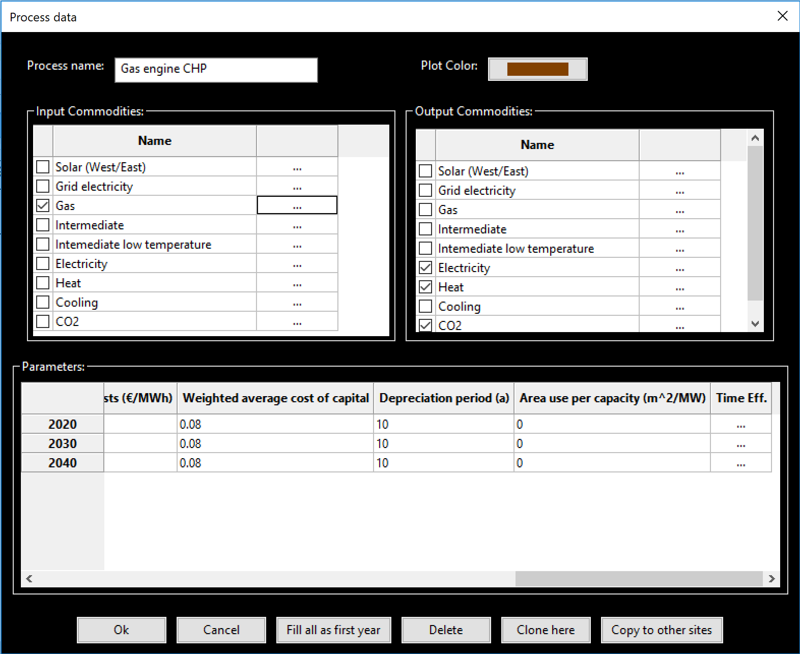
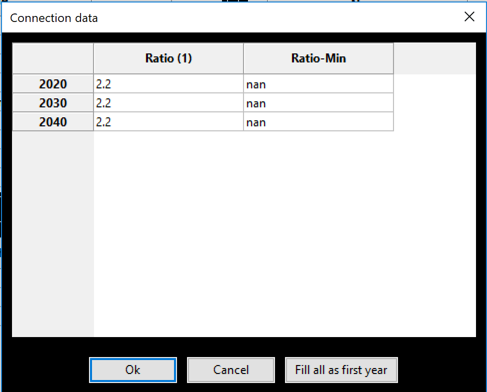
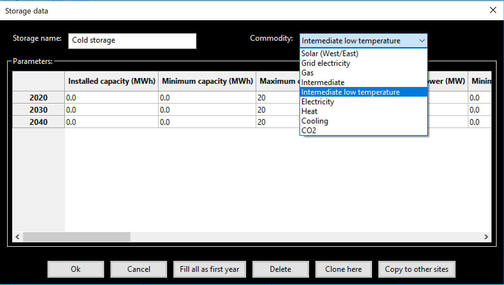

Tab Reference energy system
---------------------------
For the description of the reference energy system tabs first the standard
example of a business park and neighbouring ciy will be used. In the end of
this page a small guide for filling out this tab from scratch will be given.

To get an overview of a reference energy system tab the following picture shows
a full zoom on the entire tab for the business park in the standard example.

The tab is structured into a header line and the main field where the RES is
represented. In the header line new entities to be added can be chosen. A more
detailed description of this will be given after the extensive discussion of
the model entities themselves.

Reference energy system
^^^^^^^^^^^^^^^^^^^^^^^
The reference energy system consist of three main types of model entities:

* **Commodities** respresenting the different energy carriers are represented
  by vertical lines (buses)
* **Processes** respresenting energy conversion units are represented by
  rectangles. The commodities connected to the conversion processes are
  indicated by arrows
* **Storages** representing commodity storage possiblities are represented by
  rectangles with rounded edges

For each of these three types of model entities there exist several subtypes
which require different parameters to be set by the user.

Commodities
~~~~~~~~~~~
Commidities are typically, but not exclusively, energy carriers. They are
represented by vertical lines in the RES. There are 7 different commodity types
which play different roles within the energy system model and require different
inputs.

**Intermittend supply commodities** (SupIm) are not directly energy carriers.
They force all processes that interact with them to operate with a percentage
of their total capacity specified by a time series associated with the SupIm
commodity. A typical example for SupIm commodities is the capacity factor of
renewable energy generation units. The paramter input window that opens when
double clicking on the name or line of an existing SupIm commodity or clicking
the leftmost symbol in the RES header (Solar panel) for a new SupIm
commodity looks like this:

The window denoted 'Time series' on the right hand side opens when double
clicking on the three dots next to a modeled year in the the lower part of the
main window denoted 'Commodity data'. Here you can paste the capacity factor
time series data from a spreadsheet for each modeled year individually. You
then have to close the subwindow by clicking the 'Ok' button to confirm the
values set. In the main window you can set the display color on the upper right
hand side by clicking on the button. The checkboxes in the columns 'Plot' and
'Report' specify if the commodity will be plotted in the standard output graphs
and reported in the output excel spredsheet. In the standard example the
commodity 'Solar (West/East)' is of type SupIm and represents the capacity
factors for solar photovoltaic units with an alternating west/east inclination
of 10°. 

**Buy commodities** can be bought by an external market at a user defined
price. This price can vary with time and correspondingly price time series have
to be specified. The paramter input window that opens when double clicking on
the name or line of an existing buy commodity or clicking the second symbol on
the left in the RES header (Shopping cart) for a new buy commodity looks like
this:

The window denoted 'Time series' on the right hand side opens when clicking on
the three dots next to a modeled year in the the lower part of the main window
denoted 'Commodity data'. Here you can paste the price time series data from a
spreadsheet for each modeled year individually. You then have to close the
subwindow by clicking the 'Ok' button to confirm the values set. In the main
window you can set the display color on the upper right hand side by clicking
on the button. There are three further paramters to be set in the main window.
In the column labeled 'Price factor' (Default 1) you can set a constant
multiplier for the price time series. This paramter simplifies scenario
definitions for price variations but is typically set to 1. The columns
'Maximum commodity use' and 'Maximum commodity use per step' restrict the total
annual and hourly amount of the commodity the system is allowed to use,
respectively. The checkboxes in the columns 'Plot' and 'Report' specify if the
commodity will be plotted in the standard output graphs and reported in the
output excel spredsheet. In the standard example the only buy commodity is
called 'Grid electricity' and represents the possibility to buy electricity
from the higher level grid.

*SupIm* and *Buy* commodities are grouped in the leftmost part of the RES since
they are typically inputs of processes rather then outputs. They are separated
by a vertical dashed line from the other commodities.

**Stock commodities** can also be bought at an external market albeit at a
fixed price as opposed to buy commodities. The paramter input window that opens
when double clicking on the name or line of an existing Stock commodity or the
clicking the third symbol from the left (Flame) in the RES header for a new
Stock commodity looks like this:

You can set the display color on the upper right hand side by clicking on the
button. There are three paramters to be set for Stock commodities. In the
column labeled 'Commodity price (€/MWh)' you can set a constant price at which
the stock commodity can be bought from an external source. The columns
'Maximum commodity use' and 'Maximum commodity use per step' restrict the total
annual and hourly amount of the commodity the system is allowed to use,
respectively. The checkboxes in the columns 'Plot' and 'Report' specify if the
commodity will be plotted in the standard output graphs and reported in the
output excel spredsheet. Stock commodities can also be used to specify
intermediate helper commodities that expand the modeling possibilities
strongly. Since these cannot be bought externally the corresponding values
restricting the commodity buy capacity from an external market per year and per
hour are set to zero in this case. Next to the commodity 'Gas', which can be
bought externally for a given price, the commodities 'Intermediate' and
'Intermediate low temperature' are Stock commodities. The latter two serve to
make the model behavior more realistic. The commodity 'Intermediate'
tracks the operational state of a combined heat and power plant (CHP). This
then allows for a realistic linear operation of the power plant between
electricity and heat driven modes. This will be explained in more detail in the
Process section. The commodity 'Intermediate low temperature' has the sole
purpose of preventing the process 'Ambient air cooling' from loading the
cooling storage which would be unrealistic.

*Stock commodities* are located in the middle part of the RES since they can be
both, process inputs and outputs. They are spearated with dashed lines against
the other commodity types.

**Demand commodities** specify the commodity needs to be satisfied by the
optimization problem. A time series defines the momentary demand for the
commodities in each modeled time step. The paramter input window that opens
when double clicking on the name or line of an existing Demand commodity or
clicking the foruth symbol from the left in the RES header (Lightning) for a
new Demand commodity looks exactly like the one for SupIm commodities. In the
standard example there are three demand commodities 'Electricity', 'Heat' and
'Cooling' defined for the site 'Business park'.

**Sell commodities** are completely analogous to *Buy commodities* described
above. The only difference is that they can be sold at an external market and
not bought. Note the sign convention here: When a positive value is set in a
sell timeseries this will lead to positive revenues. The parameter input window
that opens when double clicking on the name or line of an existing sell
commodity or clicking the fifth symbol on the left in the RES header (Cash bag)
for a new sell commodity looks exactly like the one for buy commodities.

**Environmental commodities** respresent system emissions. They are the only
commodity type that is not subject to a perfect balance restriction in each
time step ('Kirchhoff current law'). Instead they can be accumulated by the
system operation. They may, however, lead to costs or be restricted by the
user. The paramter input window that opens when double clicking on
the name or line of an existing environmental commodity or clicking the sixth
symbol on the left in the RES header (Air flow) for a new environmental
commodity looks like the one for Stock commodities. In the standard example
'CO2' is the only environmental commodity.

*Demand*, *Sell* and *Environmental* commodities are displayed in the right
hand side of the RES screen, since the are typically process outputs.
Environmental commodities are strictly the rightmost ones.

Processes
~~~~~~~~~
Processes are energy conversion units. They are in general multiple input/
multiple output (mimo), i.e. they can have several commodities as inputs and
several commodities as outputs. Depending on the operational state (or
'throughput') a process consumes the inputs and gives out the outputs with a
fixed, user defined ratio times the throughput. Both the process capacity and
the throughput are central optimization variables for the model.

The parameter input window that opens when double clicking on the rectangle
representing an existing process or clicking the second symbol from the right
in the RES header (gear wheels) for a new process looks like this:

In the top part the name of the process and the color of the process in the
output graphs can be set. The parameter settings happen in two distinct parts.
In the upper middle part the input and output commodities and their respective
ratios are specified. This is done by checking the desired boxes for input and
output commodities and then duoble clicking on the box with three dots next to
those commodities. For each commidty then the following picture will open:

Under the column 'Ratio(1)' you can set the desired in- output ratio for the
process the ratios between in- and output ratios for any pair of commodities
will then be the efficiency of the corresponding commodity conversion. The
default value is *1* in this column. When you wish to model also part-load
behavior os the process you have to set a numerical value in the column
'Ratio-Min' for at least one input commodity here. This will then denote the
corresponding ratio at the minimal allowed load point. Processes where this is
set cannot be turned off completely but will be forced to operate between the
minimla allowed operation point and full load in each time step. The default
case here, however, is a flexible orperation and the default value in this
column is *nan* accordingly.

All the other inputs are to be specified in the window in the lower section of
the process window. The parameters there are the following:

* **Installed capacity (MW)** gives the capacity of the process that is already
  istalled at the start of the modeling horizon.
* **Lifetime of installed capacity (years)** gives the rest lifetime of the
  installed processes in years. A process can be used in a modeled year *y*
  still if the lifetime plus the first modeled year exceeds the next year
  *y+1*.
* **Minimum capacity (MW)** denotes a capacity target that has to be met by the
  process in a given modeled year. This means that the system will build at
  least this capacity.
* **Maximum capacity (MW)** restricts the capacity that can be built to the
  specified value.
* **Maximum power gradient (1/h)** restricts the ramping of process operational
  states, i.e. the change in the throughput variable. The value gives the
  fraction of the total capacity that can be changed in one hour. A value of
  *1* thus restricts the change from idle to full operational state
  (or vice versa) to at least a duration of one hour.
* **Minimum load fraction** gives a lower limit for the operational state of a
  process as a fraction of the total capacity. It is only relevant for
  processes where part-load behavior is modeled. A value here is only active
  when 'Ratio-Min' is numerical for at least one input commodity.
* **Investment cost (€/MW)** denotes the capacity specific investment costs for
  the process. You should give the book value here. The program will then
  translate this into the correct total, discounted cost within the model
  horizon.
* **Annual fix costs (€/MW)** represent the amount of money that has to be
  spent annually for the operation of a process capacity. They can represent,
  e.g., labour costs or calendaric ageing costs.
* **Variable costs (€/MWh)** are linked to the operation of a process and are
  to be paid for each unit of throughput through the process. They can
  represent anything from usage ageing to taxes.
* **Weighted average cost of capital** denotes the interest rate or expected
  return on investment with which the investor responsible for the energy
  system calculates.
* **Depreciation period** denotes both the economical and technical lifetime of
  all units in the system. It thus determines two things: the total costs of a
  given investment and the end of operational time for all units in the energy
  system modeled.
* **Area use per capcacity (m^2/MW)** specifies the physical area a given
  process takes up at the site it is built. This can be used, e.g. to
  restrict the capacity of solar technologies by a total maximal roof area. The
  restricting area is defined in the *Overview* tab next to the site name.
* **Time Var. Eff** by double clicking the three dots in this column a new
  window opens, where you can paste a time series from a spreadsheet similar to
  the corresponding windows for *SupIm*, *Buy*, *Sell* and *Demand*
  commodities. This time series then varies the output ratio of the process as
  a multiplier. It can be used to restrict process operations to pre-defined
  time intervalls or capture temperature dependence of the process efficiency.

Storages
~~~~~~~~
Storages are used by the system to store a single given commodity. In general
the storage capacity and charging/discharging power can be sized independently
by the system. The parameter input window that opens when double clicking on
the rectangle with rounded edges representing an existing storage or clicking
the rightmost symbol in the RES header (battery) for a new storage looks like
this:

In the case shown the drop down menu on top which is used to specify the stored
commodity is already opened. It displays all commodities in the system.

All parameter inputs for storages are to be specified in the window in the
lower section of the storage window. The parameters there are the following:

* **Installed capacity (MWh)** gives the storage capacity of storages already
  installed at the start of the modeling horizon.
* **Installed storage power (MW)** gives the charging/dischargin power of
  storages already installed at the start of the modeling horizon.
* **Lifetime of installed capacity (years)** gives the rest lifetime of the
  installed storagess in years. A storage can be used in a modeled year *y*
  still if the lifetime plus the first modeled year exceeds the next year
  *y+1*.
* **Minimum storage capacity (MWh)** denotes a storage capacity target that has
  to be met by the storage in a given modeled year. This means that the system
  will build at least this capacity.
* **Maximum storage capacity (MWh)** restricts the storage capacity that can be
  built to the specified value.
* **Minimum storage power (MW)** denotes a storage charging/discharging power
  target that has to be met by the storage in a given modeled year. This means
  that the system will build at least this power.
* **Maximum storage power (MW)** restricts the storage charging/discharging
  that can be built to the specified value.
* **Efficiency input (1)** specifies the charging efficiency of the storage.
* **Efficiency output (1)** specifies the discharging efficiency of the
  storage.
* **Investment cost capacity (€/MWh)** denotes the storage capacity specific
  investment costs for the storage. You should give the book value here. The
  program will then translate this into the correct total, discounted cost
  within the model horizon.
* **Investment cost power (€/MW)** denotes the storage charging/discharging
  power specific investment costs for the storage. You should give the book
  value here. The program will then translate this into the correct total,
  discounted cost within the model horizon.
* **Annual fix costs capacity (€/MWh)** represent the amount of money that has
  to be spent annually for the operation of a storage capacity. They can
  represent, e.g., labour costs or calendaric ageing costs.
* **Annual fix costs power (€/MW)** represent the amount of money that has to
  be spent annually for the operation of a storage power. They can represent,
  e.g., labour costs or calendaric ageing costs.
* **Variable costs capacity (€/MWh)** are linked to the operation of a given
  storage state, i.e. they lead to costs whenever a storage has a non-zero
  state of charge. These costs should typically set to zero but can be used to
  manipulate the storage duration or model state-of-charge dependent ageing.
* **Variable costs power (€/MWh)** are linked to the charging and discharging
  of a storage. Each unit of commodity leaving the storage requires the payment
  of these costs.
* **Weighted average cost of capital** denotes the interest rate or expected
  return on investment with which the investor responsible for the energy
  system calculates.
* **Depreciation period** denotes both the economical and technical lifetime of
  all units in the system. It thus determines two things: the total costs of a
  given investment and the end of operational time for all units in the energy
  system modeled.
* **Initial storage state** can be used to set the state of charge of a storages
  in the beginning of the modeling time steps. If *nan* is given this value is
  an optimization variable. In any case the storage content in the end is the
  same as in the beginning to avoid windfall profits from simply discharging a
  storage.
* **Discharge** gives the hourly dischage of a storage. Over time, when no
  charging or discharging occurs, the storage content will decrease
  exponentially. 
