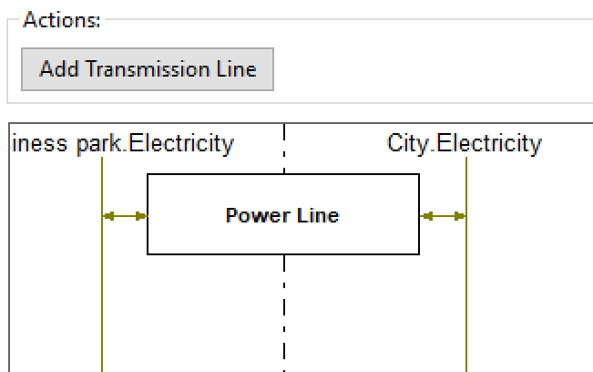
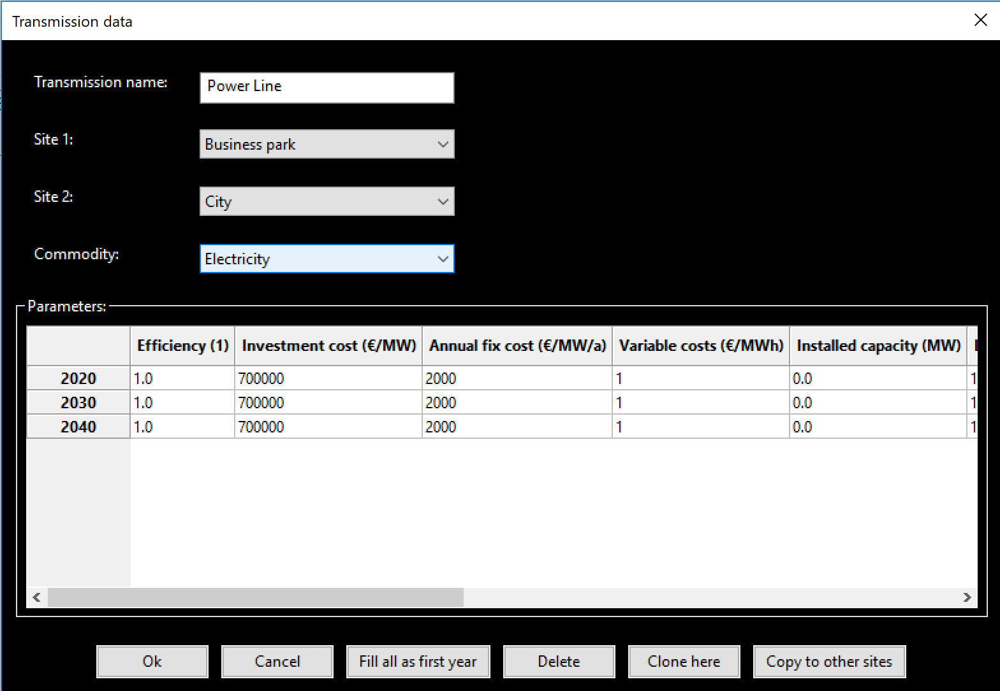

Tab Transmission
----------------
For the description of the transmission tab first the standard example of a
business park and neighbouring ciy will be used. In the end of this page a
small guide for filling out this tab from scratch will be given.

In the transmission window transportable commodities linked to any transmission
line are depicted in the typical fashion for commodities. They ae named
according to the convention 'Site.Commodity'. They only appear when an
according transmission line is added. Commodities belonging to different sites
are separated by vertical dashed lines. For the standard example
'Business_park_City' the tab looks like this:

The parameter input window that opens when double clicking on the rectangle
representing an existing transmission or clicking the rightmost symbol in the
RES header (battery) for a new transmission looks like this:

* **Efficiency (1)** specifies the transport efficiency of the transmission
  line.
* **Lifetime of installed capacity (years) (Only first file)** gives the rest
  lifetime of the installed transmission lines in years. A transmission line
  can be used in a modeled year *y* still if the lifetime plus the first
  modeled year exceeds the next year *y+1*.
* **Investment cost (€/MW)** denotes the capacity specific investment costs for
  the transmission line. You should give the book value here. The program will
  then translate this into the correct total, discounted cost within the model
  horizon.
* **Annual fix costs (€/MW)** represent the amount of money that has
  to be spent annually for the operation of a transmission capacity. They can
  represent, e.g., labour costs or calendaric ageing costs.
* **Variable costs (€/MWh)** are linked to the operation of a given
  transmission line.
* **Installed capacity (MW) (Only first file)** gives the transmission capacity
  of transmission lines already installed at the start of the modeling horizon.
* **Minimum capacity (MW)** denotes a transmission capacity target that has
  to be met by the transmission lines in a given modeled year. This means that
  the system will build at least this transmission capacity.
* **Maximum capacity (MW)** restricts the transmission capacity that can be
  built to the specified value.
* **Weighted average cost of capital** denotes the interest rate or expected
  return on investment with which the investor responsible for the energy
  system calculates.
* **Depreciation period** denotes both the economical and technical lifetime of
  all units in the system. It thus determines two things: the total costs of a
  given investment and the end of operational time for all units in the energy
  system modeled.