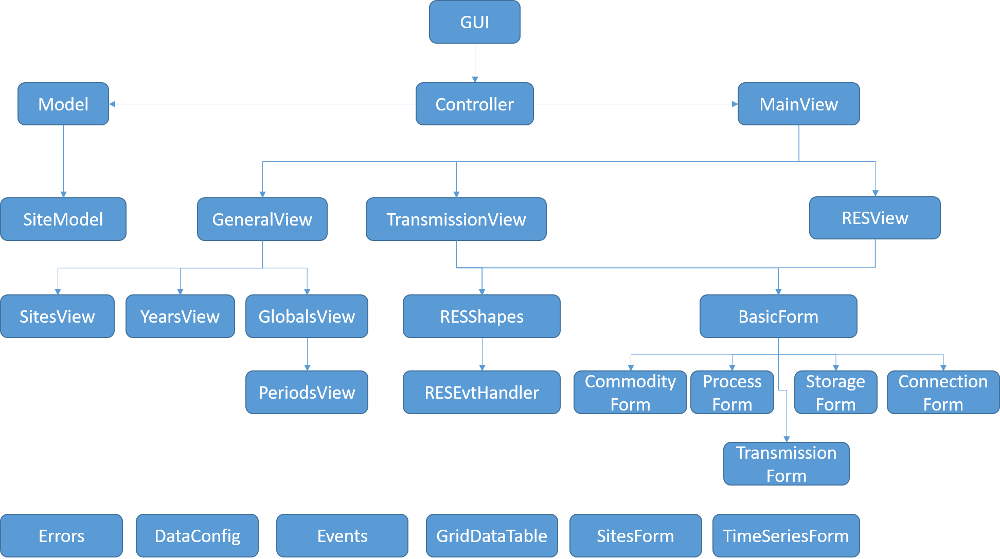

'gui' module description
=========================
This part gives a brief overview over the architecture and implementation of the Graphical User Interface (GUI).

Architecture Overview
---------------------
We are building a graphical user interface that allow the user to model complex energy systems. We are using wxpython as the main package for building our rich interface.

wxPython is a cross-platform GUI toolkit for the Python programming language. It allows Python programmers to create programs with a robust, highly functional graphical user interface, simply and easily. It is implemented as a set of Python extension modules that wrap the GUI components of the popular wxWidgets cross platform library, which is written in C++.

Like Python and wxWidgets, wxPython is Open Source, which means that it is free for anyone to use and the source code is available for anyone to look at and modify. And anyone can contribute fixes or enhancements to the project.

wxPython is a cross-platform toolkit. This means that the same program will run on multiple platforms without modification. Currently Supported platforms are Microsoft Windows, Mac OS X and macOS, and Linux or other unix-like systems with GTK2 or GTK3 libraries. In most cases the native widgets are used on each platform to provide a 100% native look and feel for the application.

Since the programming language is Python, wxPython programs are simple, easy to write and easy to understand.

Model View Controller (MVC)
^^^^^^^^^^^^^^^^^^^^^^^^^^^
MVC is all about separation of concerns.

The Model is responsible for managing the program's data (both private and client data). The View/Controller is responsible for providing the outside world with the means to interact with the program's client data.

The Model provides an internal interface (API) to enable other parts of the program to interact with it. The View/Controller provides an external interface (GUI/CLI/web form/etc.) to enable everything out the program to communicate with it.

The Model is responsible for maintaining the integrity of the program's data, because if that gets corrupted then it's game over for everyone. The View/Controller is responsible for maintaining the integrity of the UI, making sure all text views are displaying up-to-date values, disabling menu items that don't apply to the current focus, etc.

The Model contains no View/Controller code; no GUI widget classes, no code for laying out dialog boxes or receiving user input. The View/Controller contains no Model code; no code for validating URLs or performing SQL queries, and no original state either: any data held by widgets is for display purposes only, and merely a reflection of the true data stored in the Model.

Now, here's the test of a true MVC design: the program should in essence be fully functional even without a View/Controller attached. OK, the outside world will have trouble interacting with it in that form, but as long as one knows the appropriate Model API incantations, the program will hold and manipulate data as normal.

**Why is this possible?** Well, the simple answer is that it's all thanks to the low coupling between the Model and View/Controller layers. However, this isn't the full story. What's key to the whole MVC pattern is the _direction_ in which those connection goes: ALL instructions flow _from_ the View/Controller _to_ the Model. The Model NEVER tells the View/Controller what to do.

**Why?** Because in MVC, while the View/Controller is permitted to know a little about the Model (specifically, the Model's API), but the Model is not allowed to know anything whatsoever about the View/Controller.

**Why?** Because MVC is about creating a clear separation of concerns.

**Why?** To help prevent program complexity spiraling out of control and burying you, the developer, under it. The bigger the program, the greater the number of components in that program. And the more connections exist between those components, the harder it is for developers to maintain/extend/replace individual components, or even just follow how the whole system works. Ask yourself this: when looking at a diagram of the program's structure, would you rather see a tree or a cat's cradle? The MVC pattern avoids the latter by disallowing circular connections: B can connect to A, but A cannot connect to B. In this case, A is the Model and B is the View/Controller.

You'll notice a problem with the 'one-way' restriction just described: how can the Model inform the View/Controller of changes in the Model's user data when the Model isn't even allowed to know that the View/Controller exists, never mind send messages to it? But don't worry: there is a solution to this, and it's rather neat even if it does seem a bit roundabout at first.

In practical terms, then, a View/Controller object may, via the Model's API

1. Tell the Model to do things (execute commands), and 
2. Tell the Model to give it things (return data). The View/Controller layer *pushes instructions* to the Model layer and *pulls information* from the Model layer. 

Now, one last conundrum, as I hinted at earlier: how do you keep the UI's display synchronized with the Model's state in an MVC-based system?

Here's the problem: many View objects are stateful, e.g. a checkbox may be ticked or unticked, a text field may contain some editable text. However, MVC dictates that all user data be stored in the Model layer, so any data held by other layers for display purposes (the checkbox's state, the text field's current text) must therefore be a subsidiary copy of that primary Model data. But if the Model's state changes, the View's copy of that state will no longer be accurate and needs to be refreshed.

**But how?** The MVC pattern prevents the Model pushing a fresh copy of that information into the View layer. Heck, it doesn't even allow the Model to send the View a message to say its state has changed.

Well, almost. Okay, the Model layer isn't allowed to talk directly to other layers, since to do so would require it knows something about those layers, and MVC rules prevent that. However, if a tree falls in a forest and nobody's around to hear it, does it make a sound?

The answer is to set up a notifications system, providing the Model layer with a place it can announce to no-one in particular that it has just done something interesting. Other layers can then post listeners with that notification system to listen for those announcements that they're actually interested in. 

The Model layer doesn't need to know anything about who's listening (or even if anyone is listening at all!); it just posts an announcement and then forgets about it. And if anyone hears that announcement and feels like doing something afterwards - like asking the Model for some new data so it can update its on-screen display - then great. The Model just lists what notifications it sends as part of its API definition; and what anyone else does with that knowledge is up to them.

MVC is preserved, and everyone is happy. Your application framework may well provide a built-in notifications system, or you can write your own if not (see the 'observer pattern').

Our approach is to use **wx.lib.pubsub** as the method of communication.

Modules Descriptions
---------------------

The below diagram represent all modules in our solution. We will talk about each module in the next chapter.

.. toctree::
   :maxdepth: 1

   Modules