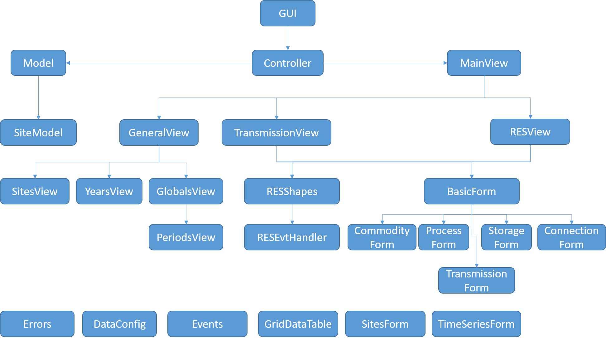

Modules Breakdown
-----------------

The below diagram represent all modules in our solution. We will talk about each module in the next chapter.

.. toctree::
   :maxdepth: 1

gui.py
^^^^^^

.. automodule:: gui.gui
    :members:

.. literalinclude:: ../../gui/gui.py
   :lines: 12-

Controller.py
^^^^^^^^^^^^^

.. automodule:: gui.Controller
    :members:

Model.py
^^^^^^^^^^^^^

.. automodule:: gui.Model
    :members:

SiteModel.py
^^^^^^^^^^^^^

.. automodule:: gui.SiteModel
    :members:

.. include:: Views.rst

.. include:: Forms.rst

.. include:: Util.rst
