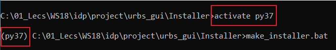

Making win installer
====================
This part gives a detailed step by step guide to make the windows installer.

Environment setup
-----------------
First of all, we need to setup our environment with the required packages and
libraries. We recommend creating a clean environment to make sure that only the
necessary libraries are packaged. Here, we will explain how to create a new
clean environment from scratch using conda.

1. Create a new virtual environment

::

    conda create -n yourenvname python=x.x

where:

* `yourenvname`: is the name of your environment (ex: py37_urbs_gui).
* `x.x`: is the desired python version (currently we use 3.7)

2. Activate your virtual environment

::

    activate yourenvname

3. Now, the environment is created and we are ready to install the necessary
packages. The following table list all the needed packages. Please go through
the list in order and start installing the packages one by one.

.. table:: *Table: Required packages*

	== ============ ======= =====================================
	#  Package name Version How to install?
	== ============ ======= =====================================
	1  Python       3.7
	2  wxPython     4.0.6   pip install wxPython
	3  numpy        1.16.4  Installed automatically with wxPython
	4  PyPubSub     4.0.3   pip install PyPubSub
	5  pyomo        5.6.4   pip install pyomo
	6  pandas       0.24.2  pip install pandas
	7  xlrd         1.2.0   pip install xlrd
	8  matplotlib   3.1.0   pip install matplotlib
	9  pywin32      224     pip install pywin32
	10 tables       3.5.2   pip install tables
	11 openpyxl     2.6.2   pip install openpyxl
	12 PyInstaller  3.4     pip install PyInstaller
	== ============ ======= =====================================

The mentioned versions in the table above are the used, tested and verified
ones. You can always go for the latest versions but pay attention to the
troubleshooting section.

Installer setup
---------------

As the environment is created, all you need now is to go to 'Installer'
directory and run the 'make_installer.bat' file. Make sure you are running the
batch file in the clean environment we created earlier (for example, the used
environment here is named 'py37')

After the batch file is executed, an exe file will be created in the
'Installer/Output' directory. With the clean environment, the size of the
created installer will be almost around 39MByte only.

.. include:: troubleshooting.rst
