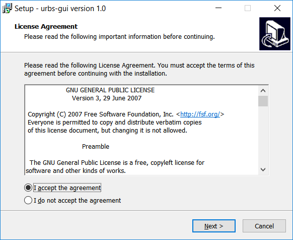
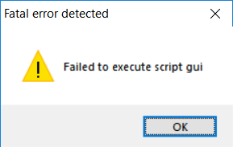
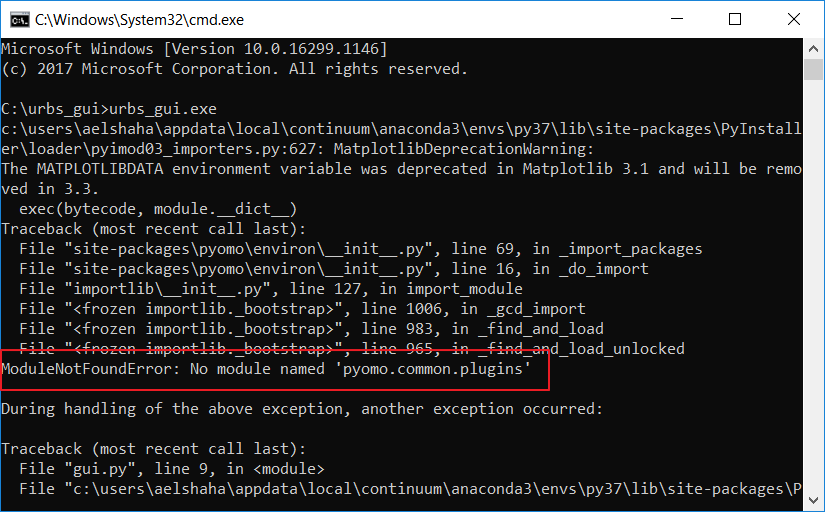

Troubleshooting
---------------

This is important section and you will have to keep an eye on it especially if
you upgraded or added new packages.

- Now, you have the installer ready in the 'Installer/Output' directory. You
  run it and just go Next with the wizard.

- After the installation, you open the program (from start menus or from
  shortcut on desktop)

- You can get the following message as start.

- The message doesn't give a proper details about the error. So we want to
  debug further.

- Go to the 'Installer' directory in our git repo, locate the file
  'urbs_gui.spec'.

- Open the file 'urbs_gui.spec' with any text editor.

- Change the line 'console=False' to be 'console=True'

.. literalinclude:: ../../Installer/urbs_gui.spec
    :lines: 34-
    :emphasize-lines: 11

- Save the file.

- Now, we will rebuild the installer file so we can get more knowledge about
  the error.

- Run the 'make_installer.bat' file again to build the installer with the
  console option enabled.

- As before, a new installer is created in the folder 'Installer/Output'.

- Open the installer, go through the wizard and install the program.

- Now, go to the installation directory that you specified in the wizard.
  The default is 'C:\\urbs_gui'.

- Open a command prompt and execute the exe file from there as following:

::

    C:\urbs_gui>urbs_gui.exe

- In the console, you can see the error details now. For instance:

- In general, 99% of the installer problems are coming from `Pyomo`_. Why?
  PyInstaller is figuring out the required imports from the explicit import
  statements in the code, and it is able to recursively inspect the necessary
  modules. But 'Pyomo' is doing that differently. They build a list of the needed
  libs and loop on programmatically.

- Go to our git repo, under the 'urbs' folder.

- Open the file 'runfunctions.py'

.. literalinclude:: ../../urbs/runfunctions.py
    :lines: 1-11
    :emphasize-lines: 2

- As you can see in the highlighted line above, 'pyomo.environ' is imported.

- In your IDE (may be Pycharm), ctrl and click on that line. This will open
  the '_init_.py' file of the 'environ' module.

- You will find the following code for importing the required packages!

::

    _packages = [
        'pyomo.common',
        'pyomo.opt',
        'pyomo.core',
        'pyomo.dataportal',
        'pyomo.duality',
        'pyomo.checker',
        'pyomo.repn',
        'pyomo.pysp',
        'pyomo.neos',
        'pyomo.solvers',
        'pyomo.gdp',
        'pyomo.mpec',
        'pyomo.dae',
        'pyomo.bilevel',
        'pyomo.scripting',
        'pyomo.network',
    ]

::

    def _import_packages():
        #
        # Import required packages
        #
        for name in _packages:
            pname = name+'.plugins'
            try:
                _do_import(pname)
            except ImportError:
                exctype, err, tb = _sys.exc_info()  # BUG?
                import traceback
                msg = "pyomo.environ failed to import %s:\nOriginal %s: %s\n"\
                      "Traceback:\n%s" \
                      % (pname, exctype.__name__, err,
                         ''.join(traceback.format_tb(tb)),)
                # clear local variables to remove circular references
                exctype = err = tb = None
                # TODO: Should this just log an error and re-raise the
                # original exception?
                raise ImportError(msg)

            pkg = _sys.modules[pname]
            pkg.load()

- As you can see from the above section, it dynamically load the above list
  of packages. Note: the code append '.plugins' to the name.

- If you recall the error we get for our installer, it was:

::

    ModuleNotFoundError: No module named 'pyomo.common.plugins'

When I upgraded the version of pyomo, the list is changed and 'pyomo.common'
for instance was not part of the previous list!

- We need to add this missing module (or the hidden import) to our build script.
  To do so, open the 'urbs_gui.spec' file and check the *hiddenimports* list.

.. literalinclude:: ../../Installer/urbs_gui.spec
    :lines: 1-33
    :emphasize-lines: 10

- Make sure that all libs defined in the *_packages* list used by `Pyomo`_
  are included in the *hiddenimports* list.

- Now, we can rebuild the installer and make sure it can start normally.
- If everything is ok, then turn the console to be *Flase* again and rebuild the
  installer for distribution.
