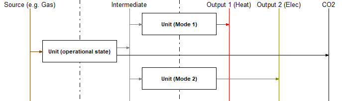
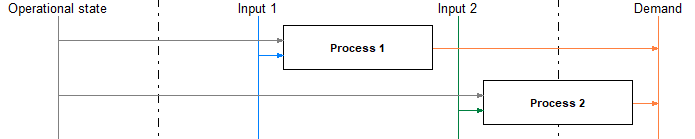

.. module:: urbs

.. _nuggets:

Modeling nuggets
================
Here you can find a collection of non-trivial modeling ideas that can be used
in linear energy system modeling with urbs. It is meant for more advanced users
and you should fully understand the two standard examples **mimo-example** and
**Business park** before proceeding. What follows is a loose collection of
modeling approaches and does not follow any internal logic.

Different operational modes
^^^^^^^^^^^^^^^^^^^^^^^^^^^
For many power plants as, e.g., combined heat and power plants (CHP) there are
different modes of operation. These and intermediate states between the
extremes can be well captured in urbs models using the approach sketched in the
following picture:

Here the vertical lines represent the commodities and the rectangle are
processes. The arrows indicate in- and output commodities of the processes. In
the case shown the power plant 'Unit' would be able to operate between a state
where only 'Output 1' comes out and a state where only 'Output 2' comes out.
The two extreme cases can, however, also be chosen as combinations of both
outputs already.

The idea behind the figure is the following:
The commodity 'Intermediate' is to be produced exclusively by the process 'Unit
(operational state)'. It thus simply tracks the throughput of this process. Due
to the vertex rule (Kirchhoff´s current law) the commodity 'Intermediate' once
produced needs to be consumed immediately. This can happen either via
'Unit (Mode 1)', 'Unit (Mode 2)' or a linear combination of both. The result is
then the desired choice for the optimizer between states formed by linear
combinations of the two modes. The commodity 'Intermediate' is best chosen as a
**Stock** commodity where either the price is set to infinity or the maximum
allowed usage per hour, or year (or both) is set to zero. This ensures that the
commodity has to be produced by the process and cannot be bought from an
external source, which for the present case would of course be absurd.

All process parameters and the setting of part load, time variable efficiency
etc. is best done for the 'Unit (operational state)' process. The two other
processes should in turn be used as mathematical entities that are defined by
their 'process commodity' input only.

Proportional operation
^^^^^^^^^^^^^^^^^^^^^^
Often many individual consumers are lumped together in one site. If a demand of
these consumers is then met by a collection of decentral units it is important
that the different technology options for these decentral units each fulfill a
fixed fraction of the demand in each time step. This means that the different
technology options are proportional to each other and the demand.

This behavior can be enforced by the following design:

Here the vertical lines represent the commodities and the rectangle are
processes. The arrows indicate in- and output commodities of the processes.

For the desired result the commodity 'Operational state' has to be of type
**SupIm** and the corresponding time series has to be set as the normalized
demand. in this way the optimizer can still size the two technology options
'Process 1' and 'Process 2' optimally while being forced to operate them
proportionally to each other and to the demand. Other input or output
(not shown) commodities can then be associated with the process operation as
usual and will be dragged along by the forced operation.
