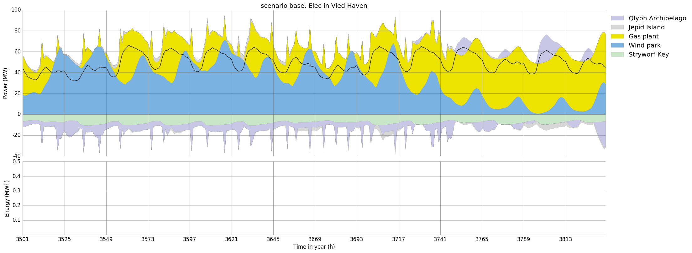

.. _workflow:

Workflow
========

This page is a step-by-step explanation on how to get one's own model running.
For the sake of an example, assume you want to investigate whether the
(imaginary) state *New Sealand* with its four islands *Vled Haven*, *Qlyph
Archipelago*, *Stryworf Key*, and *Jepid Island* would benefit by linking their
islands' power systems by costly underground cables to better integrate
fluctuating wind power generation.

Prerequisites
-------------

You have followed the sections `installation instructions`_ and `get started`_
in the README, i.e. you can successfully execute an optimisation run with the
example dataset ``mimo-example.xlsx`` with the example run script ``runme.py``.
These two files will serve as a scaffold for your own investigation.

Create a private development branch
-----------------------------------

Using git, create and directly checkout a new branch with a topical name.
Good names should tell you the goal of a branch, so something along the lines 
of ``test1234`` is no good name. For this project, ``newsealand`` looks like 
a good name::
    
    $ git checkout -b newsealand

The private branch can be used to commit your own changes, while benefitting
from new features/bug fixes that are pushed to the master branch on GitHub.
Whenever you want to retreive those new changes, execute the following
commands::

    $ git fetch origin
    $ git rebase origin/master
    
A full explanation of how to use git is beyond the scope of this documentation,
so please refer to the `Git book`__, especially chapter 1, 2, 3. 

__ http://git-scm.com/book/en/v2

Create an input data file
-------------------------

Create a copy of the file ``mimo-example.xlsx`` and give it short, descriptive
name ``newsealand.xlsx``. Open it. 

Go through the sheets, either adding, deleting or modifying rows. Keep the
column titles as they are, because they are required by the model. Each title
has a tooltip that explains the use of the parameter.

If you have created a development branch, this is a good time to add this file
to version control::
    
    $ git add newsealand.xlsx
    $ git commit -m "added newsealand.xlsx"

Site, DSM and Buy-Sell-price
^^^^^^^^^^^^^^^^^^^^^^^^^^^^
Note at the outset, that you do not have to worry about the three mentioned 
worksheets, since they are not used for this tutorial. You need to keep them, 
however, and modify them in order to avoid problems. First, specify the four 
desired Sites in **Site** and set all values to either ``NV()`` or ``inf``.
In the sheet **DSM** enter the four islands of New Sealand as sites into the 
corresponding fields and set all values in the columns *cap-max-do* and 
*cap-max-up* to ``0``. You do not need to change anything in sheet 
**Buy-Sell-Price**.  

Commodity
^^^^^^^^^
Remove the rows with unneeded commodities, here everything except **Gas**,
**Elec**, **Wind**, **CO2**, and **Slack**. *New Sealand* only uses these for
power generation. While **Slack** is not needed, it makes debugging unexpected
model behaviour much easier. Better keep it. Rename the sites to match the
island names. The file should now contain 20 rows, 5 for each island.

Let's assume that *Jepid Island* does not have access to **Gas**, so change the
parameter ``max`` and ``maxperstep`` to 0. Island *Stryworf Key* does have a
gas connection, but the pipeline can only deliver 50 MW worth of Gas power.

These steps result in the following table. The bolded values result from the
assumptions described in the previous paragraphs. The other values are left
unchanged from the example dataset:

.. csv-table:: Sheet **Commodity**; empty cells correspond to ``=NV()`` (*no value*) fields
   :header-rows: 1
   :stub-columns: 3

    Site,Commodity,Type,price,max,maxperstep
    Jepid Island,CO2,Env,,inf,inf
    Jepid Island,Elec,Demand,,,
    Jepid Island,Gas,Stock,27.0,**0.0**,**0.0**
    Jepid Island,Slack,Stock,999.0,inf,inf
    Jepid Island,Wind,SupIm,,,
    Qlyph Archipelago,CO2,Env,,inf,inf
    Qlyph Archipelago,Elec,Demand,,,
    Qlyph Archipelago,Gas,Stock,27.0,inf,inf
    Qlyph Archipelago,Slack,Stock,999.0,inf,inf
    Qlyph Archipelago,Wind,SupIm,,,
    Stryworf Key,CO2,Env,,inf,inf
    Stryworf Key,Elec,Demand,,,
    Stryworf Key,Gas,Stock,27.0,inf,**50.0**
    Stryworf Key,Slack,Stock,999.0,inf,inf
    Stryworf Key,Wind,SupIm,,,
    Vled Haven,CO2,Env,,inf,inf
    Vled Haven,Elec,Demand,,,
    Vled Haven,Gas,Stock,27.0,inf,inf
    Vled Haven,Slack,Stock,999.0,inf,inf
    Vled Haven,Wind,SupIm,,,

You have done some work already. It's time for another commit. Instead of
adding every changed file manually, you can add option ``-a`` to the commit,
which adds all **unstaged changes** from ``git status`` to the next commit.
With that::
    
    $ git commit -am "changed commodities to 4 islands in newsealand.xlsx"    
    
.. note::

    From now on, commit yourself whenever you reach a point you want to be able
    to go back to later.
    
Process
^^^^^^^

First, remove any process from sheet **Process-Commodity** that consumes or
produces a commodity that is no longer mentioned in sheet **Commodity**. Also,
ignore the column ``ratio-min`` by setting all its entries to ``=NV()``. For
*New Sealand*, this leaves us with three processes: *Gas plant*, *Slack
powerplant*, *Wind park*. The output ratio **0.6** of the *Gas plant* is the
electric efficiency.

.. csv-table:: Sheet **Process-Commodity**
   :header-rows: 1
   :stub-columns: 3
   
    Process,Commodity,Direction,ratio
    Gas plant,CO2,Out,0.2
    Gas plant,Elec,Out,**0.6**
    Gas plant,Gas,In,1.0
    Slack powerplant,CO2,Out,0.0
    Slack powerplant,Elec,Out,1.0
    Slack powerplant,Slack,In,1.0
    Wind park,Elec,Out,1.0
    Wind park,Wind,In,1.0

With only these processes remaining, the sheet **Process**, needs some work,
too. create an entry for each process that can be built at a given site. The
upper capacity limits ``cap-up`` for each process are the most important
figure. *Qlyph Archipelago* is known for its large areas suitable for wind
parks up to 200 MW, only surpased by the great offshore sites of *Jepid Island*
with 250 MW potential capacity. The other islands only have space for up to
120 MW or 80 MW. *Gas plants* can be built up to 100 MW on every island, except
for *Vled Haven*, which can house up to 80 MW only. 

*Slack powerplants* are set to an installed capacity ``inst-cap`` higher than
the peak demand in each site, so that any residual load could always be
covered. To make its use unattractive, you set the variable costs ``var-cost``
to 9 M€/MWh. This yields the following table:

.. csv-table:: Sheet **Process**
    :header-rows: 1
    :stub-columns: 2

    Site,Process,inst-cap,cap-lo,cap-up,max-grad,inv-cost,fix-cost,var-cost,wacc,depr.,area-per-cap
    Jepid Island,Gas plant,25,0,100,5,450000,6000,1.62,0.07,30,#NV 
    Jepid Island,Slack powerplant,999,999,999,inf,0,0,**9000000.0**,0.07,1,#NV 
    Jepid Island,Wind park,0,0,**250**,inf,900000,30000,0.0,0.07,25,#NV 
    Qlyph Archipelago,Gas plant,0,0,100,5,450000,6000,1.62,0.07,30,#NV 
    Qlyph Archipelago,Slack powerplant,999,999,999,inf,0,0,**9000000.0**,0.07,1,#NV 
    Qlyph Archipelago,Wind park,0,0,**200**,inf,900000,30000,0.0,0.07,25,#NV 
    Stryworf Key,Gas plant,25,0,100,5,450000,6000,1.62,0.07,30,#NV 
    Stryworf Key,Slack powerplant,999,999,999,inf,0,0,**9000000**.0,0.07,1,#NV 
    Stryworf Key,Wind park,0,0,**120**,inf,900000,30000,0.0,0.07,25,#NV 
    Vled Haven,Gas plant,0,0,80,5,450000,6000,1.62,0.07,30,#NV 
    Vled Haven,Slack powerplant,999,999,999,inf,0,0,**9000000.0**,0.07,1,#NV 
    Vled Haven,Wind park,0,0,**80**,inf,900000,30000,0.0,0.07,25,#NV 

    
Transmission
^^^^^^^^^^^^

On transmission, map the network topology of *New Sealand*. *Vled Haven* is the
central hub of the state, with the other islands connected like a star shape.
The investment costs are scaled according to the air distance from the
population centers of each island. So *Jepid Island* with 1.1 M€/MW investment
costs is more than twice as far away from *Vled Haven* than *Ylyph Archipelago*
with only 0.5 M€/MW. *Stryworf Key* is somewhere between with 0.8 M€/MW. All
investment costs are per direction. So the bidirectional cable costs are
actually the summed ``inv-cost`` for both directions.

.. csv-table:: Sheet **Transmission**
    :header-rows: 1
    :stub-columns: 4
    
    Site In,Site Out,Transmission,Commodity,eff,inv-cost,fix-cost,var-cost,inst-cap,cap-lo,cap-up,wacc,depr.
    Jepid Island,Vled Haven,undersea,Elec,0.85,**1100000**,30000,0,0,0,inf,0.07,30
    Qlyph Archipelago,Vled Haven,undersea,Elec,0.95,**500000**,15000,0,0,0,inf,0.07,30
    Stryworf Key,Vled Haven,undersea,Elec,0.9,**800000**,22500,0,0,0,inf,0.07,30
    Vled Haven,Jepid Island,undersea,Elec,0.85,1100000,30000,0,0,0,inf,0.07,30
    Vled Haven,Qlyph Archipelago,undersea,Elec,0.95,500000,15000,0,0,0,inf,0.07,30
    Vled Haven,Stryworf Key,undersea,Elec,0.9,800000,22500,0,0,0,inf,0.07,30
    
Storage
^^^^^^^

Storing electricity is possible only on *Qlyph Archipelago*, using an
unsepcified technology simply labeled *gravity* here. To allow for
parameterising a host of technologies, costs for both storage power and
capacity can be specified independently. For most technologies, one of the
costs will be dominating, so the other value can be set simply (near) zero to
reflect that. The last parameter ``init`` specifies a) how full the storage is
at the first time step and b) at least how full it must be at the final time
step. That way, a short simulation duration may not just exhaust the storage. 

.. csv-table:: Sheet **Storage** (1/2)
    :header-rows: 1
    :stub-columns: 3
    
    Site,Storage,Commodity,inst-cap-c,cap-lo-c,cap-up-c,inst-cap-p,cap-lo-p,cap-up-p,eff-in,eff-out
    Qlyph Archipelago,gravity,Elec,0,0,inf,0,0,inf,0.95,0.95
    
.. csv-table:: Sheet **Storage** (2/2)
    :header-rows: 1
    :stub-columns: 3
    
    Site,Storage,Commodity,inv-cost-p,inv-cost-c,fix-cost-p,fix-cost-c,var-cost-p,var-cost-c,depr.,wacc,init,discharge
    Qlyph Archipelago,gravity,Elec,500000,5,0,0.25,0.02,0,50,0.07,0.05,0

Hacks
^^^^^

In the base scenario, no limit on CO2 emissions from *Gas plants* is needed.
Therefore, you set the value to ``inf``:

.. csv-table:: Sheet **Hacks**
    :header-rows: 1
    :stub-columns: 1
    
    Name,Value
    Global CO2 limit,**inf**

Time series
^^^^^^^^^^^

The only commodity of type ``SupIm`` is *Wind*, which you defined in sheet
**Commodity** on all four islands. Therefore, in total 4 time series must be
provided here, even if they are all zeros. As your data provider has not kept
his promise to send you the data on time, you (ab)use the ``mimo-example.xlsx``
data once more, and simply use its time series. To get qualitatively correct
results, you assign the best (3600 full load hours) to *Jepid island*, the second
best to *Vled Haven* (3000 full load hours) and two copies of the worst time
series (2700 full load hours) to *Qlyph Archipelago* and *Stryworf Key*. With
that, you get the following table of capacity factors:

.. csv-table:: Sheet **SupIm**
    :header-rows: 1
    :stub-columns: 1
    
    t,Jepid Island.Wind,Qlyph Archipelago.Wind,Stryworf Key.Wind,Vled Haven.Wind
    0,0.0,0.0,0.0,0.0
    1,0.603,0.935,0.935,0.458
    2,0.585,0.942,0.942,0.453
    3,0.571,0.956,0.956,0.453
    4,0.561,0.956,0.956,0.461
    ...,...,...,...,...

You make sure that both the island names and the commodity name *exactly* match
the identifiers used on the other sheets.

For the demand, you also have no real data for now. But with some scaling
(divide by 1000), the example series make for a good temporary demand time
series. *Vled Haven* has the highest peak load with 75 MWh/h, followed by 
*Stryworf Key* with 19 MWh/h and the other islands with 8.2 MWh/h each:

.. csv-table:: Sheet **Demand**
    :header-rows: 1
    :stub-columns: 1
    
    t,Jepid Island.Elec,Qlyph Archipelago.Elec,Stryworf Key.Elec,Vled Haven.Elec
    0,0,0,0,0
    1,4,4,11,43
    2,4,4,10,41
    3,4,4,10,40
    4,4,4,10,40
    ...,...,...,...,...
    

.. note::

    For reference, this is how 
    :download:`newsealand.xlsx <newsealand/newsealand.xlsx>` looks for me
    having performed the above steps.

Test-drive the input
--------------------

Now that ``newsealand.xlsx`` is ready to go, start ``ipython`` in the
console. Execute the following lines, best by manually typing them in one by
one. *(Hint: use tab completion to avoid typing out function or file names!)*

First, load the data::
    
    >>> import urbs
    >>> input_file = 'newsealand.xlsx'
    >>> data = urbs.read_excel(input_file)
    
``data`` now is a standard Python :class:`dict`. So ``data.keys()`` yields the
worksheet names, while ``data['commodity']`` contains the *Commodity*
worksheet as a :class:`~pandas.DataFrame`. Now create a range and define the
length for the time steps as one hour each::
    
    >>> offset, duration = (3500, 14*24)
    >>> timesteps = range(offset, offset + duration + 1)

    [3500, 3501, ..., 3836]
	>>> dt = 1

    
Now you can create the optimisation model, then convert it to an optimisation 
problem that can be handed to the solver::
    
    >>> prob = urbs.create_model(data, dt, timesteps)

Now the only thing missing is the solver. It can be used through another object
that is generated by the ``SolverFactory`` function from the ``pyomo``
package::
    >>> import pyomo.environ
    >>> from pyomo.opt.base import SolverFactory
    >>> optim = SolverFactory('glpk')
    
Ignore the deprecation warning [1]_ for now. The solver object has a ``solve``
method, which takes the problem as an argument and returns a solution. For
bigger problems, the next step can take several hours or even days. Therefore,
you enable visible progress output by setting the option ``tee`` [2]_. 
Additionally, you can save the output to a logfile using the ``logfile`` 
option::
    
    >>> result = optim.solve(prob, logfile='solver.log', tee=True)
    
This results in roughly the following output appearing on the console::    
    
    GLPSOL: GLPK LP/MIP Solver, v4.55
    [...]
    GLPK Simplex Optimizer, v4.55
    26275 rows, 22558 columns, 63630 non-zeros
    Preprocessing...
    14793 rows, 13120 columns, 35970 non-zeros
    Scaling...
     A: min|aij| = 2.305e-003  max|aij| = 1.053e+000  ratio = 4.567e+002
    GM: min|aij| = 3.606e-001  max|aij| = 2.773e+000  ratio = 7.691e+000
    EQ: min|aij| = 1.300e-001  max|aij| = 1.000e+000  ratio = 7.691e+000
    Constructing initial basis...
    Size of triangular part is 14790
          0: obj =  3.000000000e+005  infeas = 2.158e+004 (3)
        500: obj =  2.443067336e+007  infeas = 8.024e+003 (3)
       1000: obj =  3.635166806e+011  infeas = 5.311e+003 (3)
    *  1379: obj =  1.688377193e+012  infeas = 0.000e+000 (3)
    [...]
    *  5500: obj =  3.438413434e+007  infeas = 6.221e-014 (3)
    *  5822: obj =  3.419699391e+007  infeas = 7.889e-031 (3)
    OPTIMAL LP SOLUTION FOUND
    Time used:   3.5 secs
    Memory used: 25.3 Mb (26496968 bytes)
    Writing basic solution to '<temporary.glpk.raw>'...
    48835 lines were written

Finally, you can load the result back into the optimisation problem oject
``prob``::

    >>> prob.solutions.load_from(result)
    True
    
This object now contains all input data, the equations and result data. If you
store this object as a file (an HDF5 file in particular), you can later always
create new analyses from it. That's what :func:`save` is made for:

    >>> urbs.save(prob, os.path.join(result_dir, '{}.h5'.format(sce)))
    
This becomes especially helpful for large problems that take hours to solve.
Back to the ``prob``. To get a quick numerical overview on the most important
result numbers, use :func:`report`::
    
    >>> urbs.report(
	...		prob,
    ...		os.path.join(result_dir, '{}.xlsx').format(sce),
    ...		report_tuples=report_tuples,
    ...		report_sites_name=report_sites_name)

By default, this report only includes total costs and capacities of process,
transmission and storage. By adding the optional third and fourth parameter,
you can retrieve timeseries listings of energy production per site. For now,
you are only interested in *electricity* in *Vled Haven*::
    
    >>> urbs.report(
	...		prob,
	...		'report-vled-haven.xlsx',
    ...     report_tuples=[('Vled Haven','Elec')],
	...		report_sites_name={'Vled Haven':'Preferred name for Vled Haven (optional)'})
    
Then you finally want to see how the electricity production *looks* like. For 
that you use :func:`result_figures`::

    >>> urbs.result_figures(
	...		prob,
	...		'plot-vled-haven',
	...		plot_title_prefix=sce.replace('_', ' '),
	...		plot_tuples=[('Vled-Haven','Elec')],
	...		plot_sites_name={'Vled Haven':'Preferred name for Vled Haven (optional)'},
	...		periods=plot_periods,
	...		figure_size=(24, 9))
	

    
Depending on the plotting backend, you now either see a window with the plot
('TkAgg', 'QtAgg'), or nothing. Either way, you can save the figure to a file
using::

    >>> if extensions is None:
	>>> 	extensions = ['png', 'pdf'] 
	>>> for ext in extensions:
	>>>		fig_filename = '{}-{}-{}-{}.{}'.format(
    ...         figure_basename, com, ''.join(
    ...         plot_sites_name[sit]), period, ext)
    >>>     fig.savefig(fig_filename, bbox_inches='tight')

    
The file extension determines how the output is written. Among the supported
formats are jpg, pdf, png, svg and tif. Use ``png`` if raster images are needed
and rely on ``pdf`` or ``svg`` for vector output. The ``dpi`` option is only
used for raster images. ``bbox_inches='tight'`` removes unnecessary whitespace
around the plot, making it suitable for inclusion in reports or presentations.
    
    
Create a run script
-------------------

As it is quite tedious to perform the above actions by hand all the time,
a script can automate these. This is where a ``runme.py`` script becomes handy. 

Create a copy of the script file ``runme.py`` and give it a suitable name, 
e.g. ``runns.py``.

Modify the ``scenario_co2_limit`` function. As the base scenario now has no
limit, reducing it by 95 % does not make it finite. Therefore you set a fixed
hard (annual) limit of 40 million tonnes of CO2 equivalent:
    
.. code-block:: python
   :emphasize-lines: 4

    def scenario_co2_limit(data):
        # change global CO2 limit
        global_prop = data['global_prop']
		global_prop.loc['CO2 limit', 'value'] = 40000
        return data

Next, set adjust the plot_tuples and report_tuples by replacing ``North``, 
``Mid`` and ``South`` by the four islands of Newsealand. 
Furthermore, you want to show imported/exported electricity in the plots in 
custom colors. So you modify the ``my_colors`` :class:`dict` like this::
    
    my_colors = {
        'Vled Haven': (230, 200, 200),
        'Stryworf Key': (200, 230, 200),
        'Qlyph Archipelago': (200, 200, 230),
        'Jepid Island': (215,215,215)}

Finally, you head down to the ``if __name__ == '__main__'`` section that is
executed when the script is called. There, you change the ``input_file`` to
your spreadsheet ``newsealand.xlsx`` and increase the optimisation duration to
14 days (``14*24`` time steps). For now, you don't need the other scenarios,
so you exclude them from the ``scenarios`` :class:`list`:

.. code-block:: python
   :emphasize-lines: 2,6,10,11,12 
   
    if __name__ == '__main__':
        input_file = 'newsealand.xlsx'
        result_name = os.path.splitext(input_file)[0]  # cut away file extension
        result_dir = prepare_result_directory(result_name)  # name + time stamp
    
        (offset, length) = (3500, 14*24)  # time step selection
        timesteps = range(offset, offset+length+1)
        dt = 1 
		
        # select scenarios to be run
        scenarios = [
            scenario_base,
            scenario_co2_limit]

    # define the commodities/sites to be plotted
    plot_tuples = [
        ('Vled Haven', 'Elec'),
        ('Stryworf Key', 'Elec'),
        ('Qlyph Archipelago', 'Elec'),
        ('Jepid Island', 'Elec'),		
        (['Vled Haven', 'Stryworf Key', 'Qlyph Archipelago','Jepid Island'], 'Elec')]

    # optional: define names for sites in plot_tuples
    plot_sites_name = {('Vled Haven', 'Stryworf Key', 'Qlyph Archipelago','Jepid Island'): 'All'}

    # define the commodities/sites to be reported
    report_tuples = [
        ('Vled Haven', 'Elec'), ('Stryworf Key', 'Elec'), ('Qlyph Archipelago', 'Elec'), ('Jepid Island', 'Elec'),
        ('Vled Haven', 'CO2'), ('Stryworf Key', 'CO2'), ('Qlyph Archipelago', 'CO2'), ('Jepid Island', 'CO2')]

    # optional: define names for sites in report_tuples
    report_sites_name = {'Vled Haven': 'Another name for Vled Haven'}

    # define the time periods to be plotted
    plot_periods = {
        'all': timesteps[1:]
    }
			
        for scenario in scenarios:
            prob = run_scenario(input_file, timesteps, scenario, result_dir, dt,
                            plot_tuples=plot_tuples,
                            plot_sites_name=plot_sites_name,
                            plot_periods=plot_periods,
                            report_tuples=report_tuples,
                            report_sites_name=report_sites_name)

            
.. note::

    For reference, here is how :download:`runns.py <newsealand/runns.py>` looks
    for me.

.. _installation instructions: 
   https://github.com/tum-ens/urbs/blob/master/README.md#installation
.. _get started:
   https://github.com/tum-ens/urbs/blob/master/README.md#get-started
   
.. [1] If you used Coopr 4.0, simply ``import coopr.environ`` before importing
   ``SolverFactory``.
.. [2] like the GNU `tee <http://man.cx/tee>`_ output redirection tool.   
